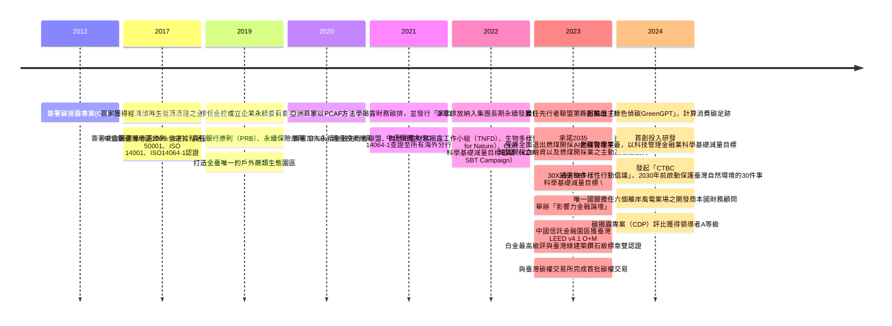
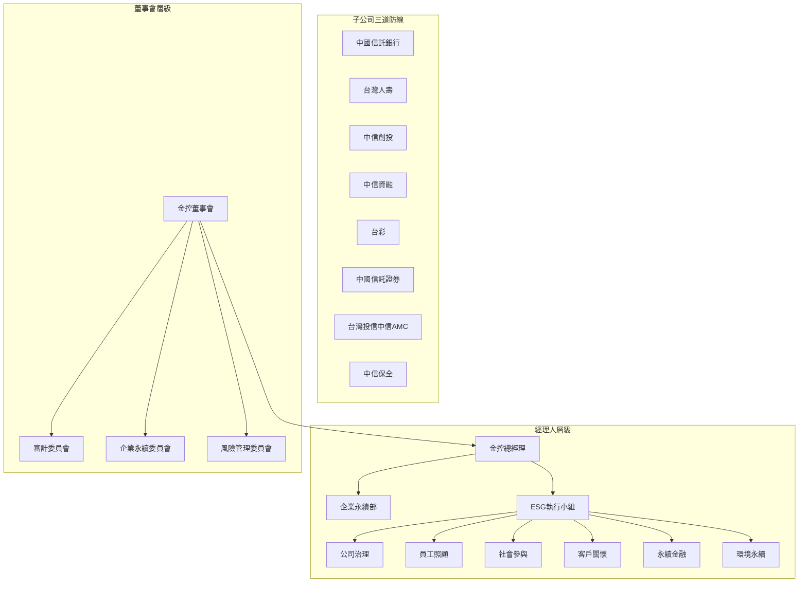
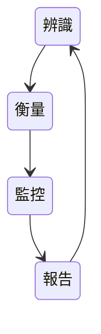
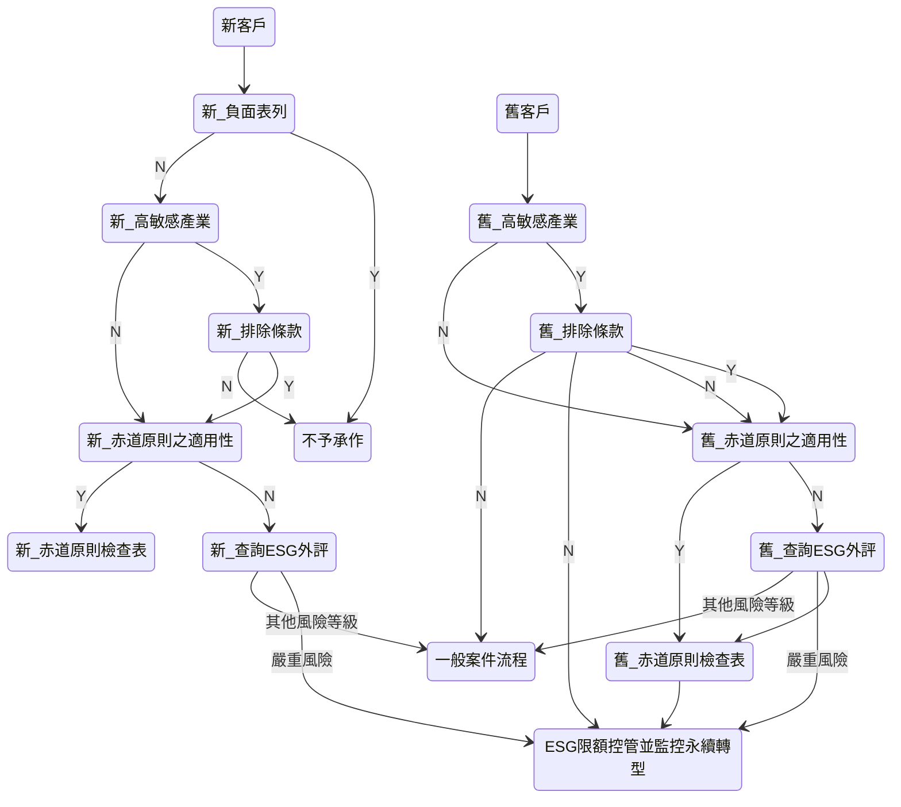
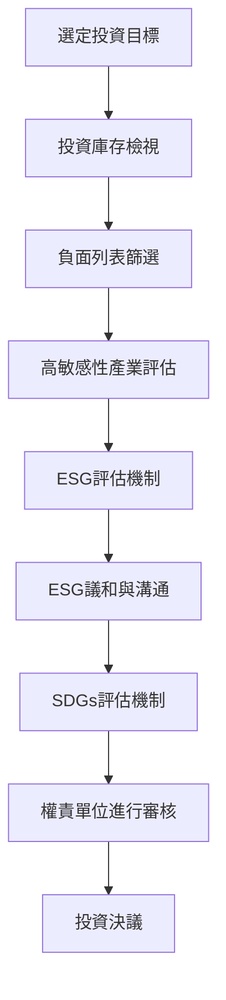
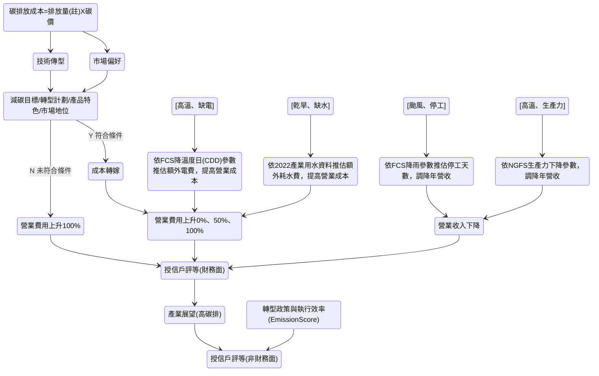
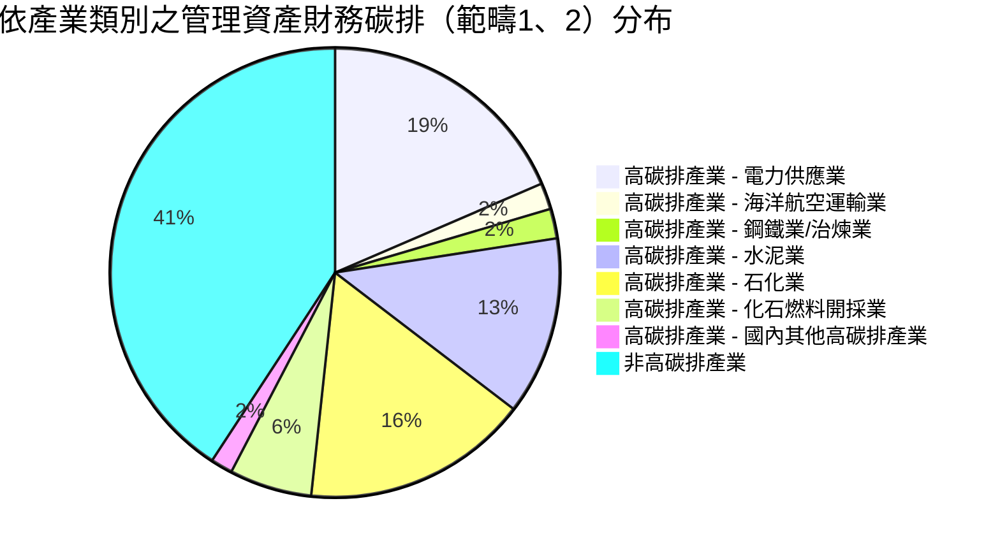
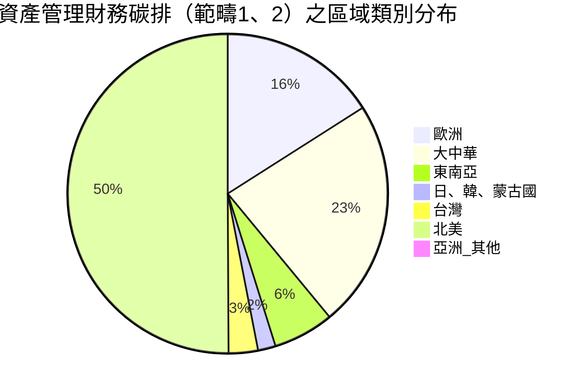
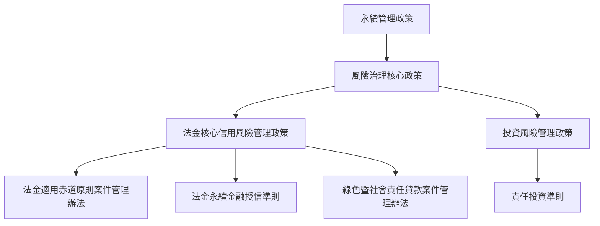
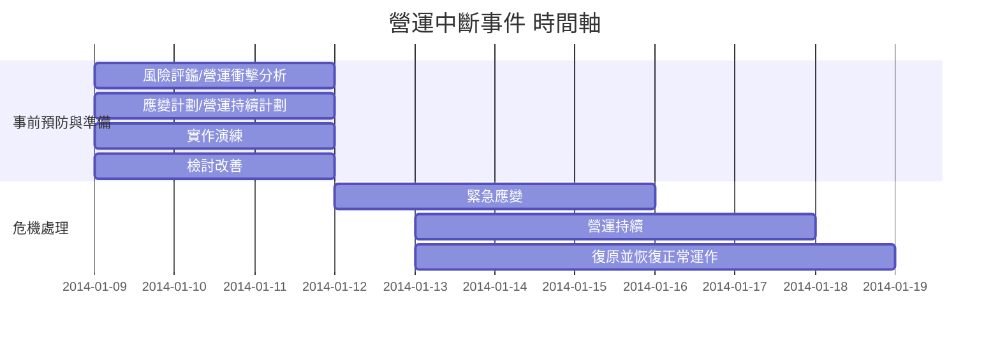

##  中國信託金控 CTBC HOLDING 
# 2024 氣候相關財務接露報告書
# Climate-relate Financial Discloser Report

---

## 目錄
>董事長的話 02
>關於本報告書 03
>事蹟年表 04
>年度活動摘要 05
>亮點分享 09


1. 治理
>1.1 董事會在氣候相關風險與機會治理的角色 13
>1.2 管理階層在氣候相關風險與機會治理的角色 14
>1.3 氣候文化與能力培育 15

2. 策略
>2.1 氣候相關重大風險與機會辨識結果 18
>2.2 氣候策略及實施計畫 25
>2.3 議合策略 27


3. 風險管理
>3.1 氣候相關政策與風險管理程序 30
>3.2 信用風險管理 33
>3.3 市場風險管理 35
>3.4 國家風險管理 35
>3.5 保險風險管理 36
>3.6 不動產投資風險管理 37
>3.7 管理資產與風險管理 37
>3.8 作業風險及供應商管理 37

4. 氣候情境分析
>4.1 情境設立 40
>4.2 情境分析範圍與方法 42
>4.3 集團整合情境分析結果 44
>4.4 其他探索型情境分析結果 58


5. 指標與目標
>5.1 綠色營運與指標 62 
>5.2 綠色金融指標 64
>5.3 氣候風險相關指標 65
>5.4 投融資組合科學減碳目標 74
>5.5 其他指標 76

6. 附錄
>6.1 中國信託商業銀行股份有限公司 80
>6.2 會計師確信報告 87
>6.3 FSB TCFD揭露建議與中信金控揭露內容之對照表 91


---

# 董事長的話 

2024 年是區域穩定性備受考驗的一年，美中關係在科技與貿易領域持續角力；歐洲面臨俄烏戰爭的長期消耗；中東地區以色列與哈馬斯衝突延續，多方因素牽動全球能源市場價格波動。但是2024 年亦是全球碳市場機制取得重大進展的一年，因為在聯合國氣候峰會（COP29）中通過「巴黎氣候協定」第6.4 條的指導規範，此規範涵蓋國際碳市場交易與減排成果的計算細則（系統機制、清潔發展機制、減排量的授權與使用），更為全球碳市場的透明度和有效運行奠定了基礎。


中信金控身為臺灣金融領導品牌，秉持企業社會責任，配合政府「綠色及轉型金融行動方案」持續深化綠色金融、綠色
營運作為。2024 年中信金控在精進永續金融評鑑及合作機制面，以「金融業淨零推動工作平台- 資料與風控組工作群」
之召集人身分邀請經濟部水利署水利規劃分署專家與工作群成員分享臺灣水文與淹水風險評估現況，並分享「金融業氣候實體風險資訊整合平台」建置成果，以利金融業者運用並評估氣候相關風險。在揭露面表現上，中信金控旗下子公司中信銀行、台灣人壽與中信產險，皆榮獲由金融監督管理委員會指導、政治大學企業永續管理研究中心主辦之「第一屆氣候相關財務揭露（TCFD）報告書評鑑」績優獎，彰顯中信集團在永續資訊揭露透明度、風險管理與氣候治理面向上的高度表現。在資金面，中信銀行持續與工業技術研究院合作，透過分享綠色金融與減碳技術成果，加速企業客戶的轉型腳步；中信金控更於2024年供應商大會中首度頒發「供應商評鑑永續卓越獎」，凝聚供應鏈夥伴共識，共同邁向2050淨零目標。

國際氣候治理合作牽涉多方複雜議題，包括政治現實及國家戰略考量，短期內亦可能有國際氣候行動受到阻
礙之情事，但如同易經履卦所言「履道坦坦，幽人貞吉。」，中信金控將持續扮演連結綠色金融創新與產業態圈，攜手利害關係人邁向具氣候韌性的永續社會。
<br>
**顏文隆 Wen Long Yen Chairman**

**02**

---
# 關於本報告書


2024 氣候相關財務揭露報告書（簡稱：本報告書）除依據國際金融穩定委員會（Financial Stability Board, FSB）氣候相關財務揭露工作小組（Task Force on Climate-related Financial Disclosures, TCFD）建議的揭露框架外，更開始逐步對接由國際永續準則委員會（InternationalSustainability Standards Board, ISSB）所制定的國際財務報導準則第S２號「氣候相關揭露」（簡稱：IFRS S2）之相關規定，俾使一般用途財務報告之主要使用者能更全面瞭解中信金控氣候相關風險與機會之治理、策略、風險管理、指標與目標進展，以呼應中信金控朝向2025淨零碳排放的決心。


**報告範疇** 

本報告書內容涵蓋中國信託金融控股股份有限公司（簡稱：中信金控或本公司）暨旗下中國信託商業銀行股份有限公司（簡稱：中信銀行）、台灣人壽保險股份有限公司（簡稱：台灣人壽）、中國信託綜合證券股份有限公司（簡稱：中信證券）、中國信託創業投資股份有限公司（簡稱：中信創投）、中國信託資產管理股份有限公司（簡稱：中信 AMC）、中國信託證券投資信託股份有限公司（簡稱：中信投信）、中信保全股份有限公司（簡稱：中信保全）、台灣彩券股份有限公司（簡稱：台彩）及中國信託資融股份有限公司（簡稱：中信資融）等九間子公司。


**報告期間**
本報告書之報告期間為2024 年1 月1 日至 2024 年12 月31 日。


**報告書確信**
就本報告書中氣候相關風險之特定指標，本公司委託安侯建業聯合會計師事務所（KPMG），依據確信準則3000 號、確信準則3410 號進行有限確信（limited assurance），確信報告附於本報告書附錄；針對氣候相關機會之特定指標，本公司亦委託安侯建業聯合會計師事務所（KPMG）依據確信準則3000 號進行有限確信（limited assurance），相關確信指標請參照本報告書附錄，並且另行參閱 2024 年中信金控永續報告書。

**03**

---

# 事蹟年表


**04**

---

# 年度活動摘要


### 邀請經濟部水利署專家分享臺灣水文與淹水風險評估（2024 年1 月）

臺灣短時強降雨事件日益頻繁，單日累積雨量超過300 毫米的極端天氣現象屢見不鮮，易使排水設施無法及時消化而導致淹水。基此，中信金控以「金融業淨零推動工作平台- 資料與風控組工作群」之召集人身分，邀請經濟部水利署水利規劃分署專家分享專業觀點。
<br>
會中專家說明目前全臺設有1,110 座雨量站、334 座水位站及1,802 個淹水感測器，並透過CCTV 監測淹水熱區，透過這些數據水利署可即時掌握降雨趨勢與水位變化，提升防災預警能力。此外，水利署近年導入AI 與大數據技術，推出「行動水情APP」與「AI Robot Diana 智慧應答機器人」，提供即時水情資訊與防災建議。最後，水利署介紹第四代淹水潛勢圖（預估2027 年可以完成全臺第四代淹水圖資）和第三代淹水潛勢圖的技術核心差異及淹水圖資的應用方式。
<br>
本次教育訓練圍繞水文分析、水利基礎資料應用及淹水風險評估等議題，吸引約130 名金融同業參與。與會者與專家深入交流最新成果和技術應用，對於淹水風險有更全面的理解，獲益匪淺。

<br>

### 中信金控受邀至綠色及永續金融人才專班分享（2024年8 月）
中信金控作為永續轉型的標竿，受證券暨期貨市場發展基金會邀請，於綠色及永續金融人才專班中分享「金融業氣候實體風險資訊整合平台」。
<br>
中信金控游副總欣慧表示，風險衡量與數據分析是金融機構風險控管及業務商機的重要決策依據，金融機構卻面臨氣候相關風險的「資料可取得性」、「資料品質」、及「資料可比性」三大挑戰。為利金融業資料應用，協助金融機構對氣候實體風險原始資料解讀不易的困難，金管會、聯徵中心及永續金融先行者聯盟的「資料與風控工作群」，於2023年收集金融機構氣候風險相關資料需求，彙整國內政府單位可提供之所有氣候相關原始資料，並請聯徵中心及顧問團隊協助轉譯資料為符合金融業所需資訊，建置「氣候實體風險資訊整合平台」，免費供金管會所轄金融業運用，以利評估氣候相關風險。

**05**

---


### 中信銀行、台灣人壽及中信產險獲頒第一屆氣候相關財務揭露（TCFD）報告書評鑑績優獎（2024 年9 月）

國立政治大學企業永續管理研究中心舉辦「第一屆氣候相關財務揭露（TCFD）報告書評鑑頒獎典禮暨研討會」。本次評鑑是依據國際金融穩定委員會（Financial Stability Board,FSB）於2017 及2021 年公布氣候相關財務揭露建議，並參照我國金管會於2021 年底公布的氣候相關財務揭露指引進行評鑑。其次，在評鑑過程中，更發揮教學的功能，對於如何精進報告書的內容，提供建議並分享研究發現與成果。透過TCFD 報告書評鑑，讓社會大眾可以了解金融業在氣候相關議題上的努力，也能讓出版TCFD報告書傑出的企業，成為金融同業的典範 。此次受評鑑機構包括：本國銀行38 家，保險業
44 家（含在台分公司及再保險公司）﹔中信銀行、台灣人壽及中信產險均獲頒績優獎項。
<br>

### 中國信託銀行與工業技術研究院第二度合作舉辦「淨零永續關鍵行動論壇」（2024 年9 月）
中信銀行2023 年首度跨域攜手工研院，結合永續金融與淨零技術推出「355 減碳計畫 」實質幫助多家企業客戶邁向淨零轉型。為延續強強聯手激盪火花，2024 年再度攜手工研院合作舉辦「淨零永續關鍵行動論壇」，分享雙方合作產業鏈大帶小淨零減碳及綠色金融科技應用的執行成果。中信銀行與工研院共同邀請產、官、學、研代表共聚一堂，從國際趨勢觀察解析淨零永續的三支箭－綠色新政、綠色經濟及綠色金融，協助產業化危機為轉機並發展商機，線上線下逾3,000 人共襄盛舉。
**06**

---


### 中信金控助攻臺灣成為亞洲離岸風電產業聚落（2024 年10 月）


**臺灣唯一六大離岸風場之本國財務顧問**
2017 年中信銀行領先同業，設置專責「財務顧問」及「專案融資」團隊，積極參與國內離岸風場開發，力挺臺灣發展再 生能源，成為唯一國內銀行擔任六大離岸風場註開發商的本國財務顧
問，主辦聯貸金額累積逾新臺幣4,700 億元，裝置容量 累積逾3,700MW（百萬瓦）。中信銀行擔任統籌主辦行，為離岸風場開發商量身打造永續金融服務，提供綠能市場趨勢分 析、綠電購置規劃與投融資架構建議等完整財務顧問服務，以及靈活的資金融通渠道，攜手開發商、國內外金融機構與國家 融資保證中心，樹立離岸風場綠能融資的新里程碑。
<br>
**沃旭能源大彰化西北風場 - 2024 年臺灣最大離岸風場聯貸案**
繼2021 年中信銀行主辦沃旭能源- 大彰化東南風場聯貸案後，2024 年再度成為沃旭
能源 - 大彰化西北風場財務顧問及統 籌主辦行，該案場裝置容量為583MW，融資規模
達新臺幣600 億元，創2024 年臺灣離岸風場融資案最高金額，本案不僅官股銀行首度
參與，更首次引進國家融資保證機制，開啟離岸風場信用保證新頁，更獲得多項國際
獎項肯定:
Global Finance:Sustainable Finance Deal of the Year, Global 全球年度最佳永續金融專案融資 Global Finance:Sustainable Finance Deal of the Year in Asia-Pacific 亞太年度最佳永續金融專案融資

**註：六大離岸風場：彰芳暨西島、大彰化東南、中能、大彰化西北、渢妙、大彰化西南。**


<br>

### 2024 中信金控供應商大會（2024 年10 月）
中信金控攜手供應商打造永續供應鏈，於「2024中信金控供應商大會」號召 188 家供應商共同承諾淨零排放及保育自然環境。為鼓勵更多供應商共同邁向 2050 淨零排放，中信金控首次頒發「供應商評鑑永續卓越獎」，依照中信金控「供應商管理原則」，以人權保障、環境永續、行為準則及個資隱私保護等作為評估，透過自評問卷、實地訪查確認真實性，具體落實永續風險評估管理，遴選名列前茅之供應商。中信金控亦於本屆供應商大會中提出「CTBC 30X30 生物多樣性行動倡議」，邀請供應商共同守護臺灣自然資源與物種。

**07**

---


### 中信金榮獲「2024 台灣企業永續獎- 氣候領袖獎」單項績效獎等八大獎項（2024 年11 月）
中信金控積極落實ESG 永續作為，一舉奪得「2024 台灣企業永續獎」單項績效獎八大獎項，包括「氣候領袖獎」與「循環經濟領袖獎」等殊榮，顯示中國信託致力永續發展備受肯定。
<br>
身為碳核算金融聯盟（PCAF）亞太區主席，中信金控響應國內外永續倡議、依循科學基礎減量目標（SBT）實踐減碳計畫，持續發揮強健的風險管理能力，並承諾2035 年全面退出燃煤開採業投融資；中信銀行則自2017 年成立專責團隊深耕離岸風電專案融資，截至2024 年底為唯一擔任六大離岸風電案場之開發商本國財務顧問，累積主辦聯貸金額逾新臺幣4,700 億元、裝置容量逾3,700 百萬瓦（MW），其中包含臺灣及亞太區域迄今最大規模的海龍離岸風電專案融資，推動能源轉型。此外，更於12 月再度奪下「2024 台灣企業永續獎」之「綜合績效獎」及三項「企業永續報告獎」，旗下子公司中信銀行董事長陳佳文更榮膺「永續傑出人物獎」，為中國信託金控第三度榮獲「台灣企業永續獎」個人獎項的最高榮譽。

**08**

---

# 亮點分享 
>### 中信金控2024年SBT目標達成情形
>|SBT資產類別|目標類型|燈號|
>|---|---|---|
>|商用不動產授信|SDA_kCO₂e/m2|綠|
>|電廠專案融資|SDA_tCO₂/MWh|綠|
>|企業授信（電力供應業）|SDA_tCO₂/MWh|黃|
>|企業授信（一年期以上，不含SME）|TR（S1+S2）|綠|
>|企業授信（一年期以上，不含SME）|TR（S1+S2+S3）|綠|
>|上市櫃股權、債券投資、ETF<br>與共同基金|TR（S1+S2）|綠|
>|上市櫃股權、債券投資、ETF<br>與共同基金|TR（S1+S2+S3）|綠|
><br>
><br>
>
>### 中信金控2023年頭融資/管理資產/保險溫室氣體排放情形
>
>>```mermaid
>>pie title 投融資組合
>>    "商業貸款" : 46
>>    "主權債務" : 29
>>    "股權及公司債投資" : 20
>>    "電廠專案融資" : 2
>>    "房屋貸款" : 2
>>    "商業不動產融資" : 1
>>```
>>**總碳排放量19,255,766**
>>**碳足跡4.1**
>
><br>
>
>>```mermaid
>>pie title 投信管理資產
>>"被動式基金" : 93
>>"主動式基金" : 7
>>```
>>**總碳排放量2,622,250**
>>**碳足跡4**
>
><br>
>
>>```mermaid
>>pie title 商業與個人汽車保險
>>"個人車險" : 56
>>"商業保險" : 44
>>```
>>**總碳排放量15660**
**碳足跡6.8**
<br>


>**- 颱風洪水險保費收入 +31% (相較於2023年)**
>**- 納入範疇一級二盤查之據點數達25家(2024年)**
>**- 再生能源利用，制碳排量 -3.764公噸(2024年)**
>**- 綠能科技+循環經濟+綠電與再生能源產業+綠色支出+永續績效連結貸款總放款餘額達新臺幣3,575億元(2024 年)**
>**- 綠色債劵承銷、發行績效+143%(相較2023年)**

**09**

---

# 1. 治理
**1.1 董事會在氣候相關風險與機會治理的角色 13**
**1.2 管理階層在氣候相關風險與機會治理的角色 14**
**1.3 氣候文化與能力培育 15**

<br>

**11**

---
# 氣候相關風險與機會治理架構圖


<br>
<br>
<br>

**經理層級人:**
由環境永續及永續金融跨小組推動企業永續暨氣候相關機會/風險管理與目標監控

|金控投資長|金控風險長|銀行策略長|總務單位最高主管|
|---|---|---|---|
|責任投資 PRI 編組|氣候及自然風險管理編組|責任銀行 PRB 編組|環境永續編組|

<br>
<br>
<br>

**12**

---
# 1.1 董事會在氣候相關風險與機會治理的角色
中信金控董事會由7 位成員組成，其中4 名為獨立董事（占全體董事比例約57%）。董事會下設企業永續委員會、風險管理委員會、及審計委員會，協助董事會審議氣候相關議題。2024 年就氣候（含自然）相關議案共13 案，主題涵蓋永續相關年度計畫與目標、範疇一/二/ 三科學基礎減碳目標設立與管理策略、接軌 IFRS 永續揭露準則專案計劃、氣候相關風險管理政策修訂、以及定期之氣候相關風險指
標與目標等監控報告。


|董事會層級| 主席/召集人|組成成員|開會頻率|氣候相關風險與機會之職責概述|
|---|---|---|---|---|
董事會|董事長|金控董事|每月|為氣候/自然相關風險與機會議題之最高督導單位，負責核定政策、目標與重大決策，監督氣候相關風險與機會之工作進展與事務推動，並確保公司於重要資本支出或企業併購(註) 時，妥善考量氣候相關風險與機會。|
|企業永續委員會（功能性委員會）|獨立董事|4名獨立董事|每年至少召開二次|審議ESG各任務編組之年度計畫/目標及執行成效；每季檢視集團範疇一及範疇二之溫室氣體盤查執行進度。|
風險管理委員會（功能性委員會）|獨立董事|3名獨立董事|每月|審議集團氣候風險管理政策；每半年檢視轉型及實體風險變化、以及範疇三財務碳排放與科學基礎減碳目標達成情形等。|
審計委員會（功能性委員會）|獨立董事|4名獨立董事|每月|審議內部稽核單位就氣候相關風險與機會之內部控制制度及稽核發現事項|

*註：以本公司執行併購前評估為例：中信金控係依「中國信託金融控股公司購併專案管理辦法」進行企業價值評估，過程中除綜合考量各類風險與機會外，亦包括標的公司之氣候相關風險執行情形，綜合評估結果將成為董事會審議購併案件之參考依據。*

**13**

---


# 1.2 管理階層在氣候相關風險與機會治理的角色

中信金控在兼顧本公司業務成長、利害關係人（ Stakeholder）權益以及環境、社會的永續發展之下，於管理階層設置ESG 執行小組，依「公司治理」、「環境永續」、「員工照顧」、「永續金融」、「社會參與」、及「客戶關懷」六大面向設立多個任務編組，其中在「環境永續」面向下設有「氣候及自然風險管理編組」、「環境永續編組」；在永續金融面設有「責任銀行PRB 編組」、「責任投資PRI 編組」等，負責規劃並落實執行氣候相關管理策略與計畫。


管理層級|主席 / 督導主管|組成成員/單位|開會頻率|氣候相關風險與機會之職責概述
|---|---|---|---|---|
ESG執行小組|金控總經理|金控功能長及各子公司總經理|每季|統籌集團各項永續專案的執行與資源配置， 追蹤與檢討各任務編組之執行情形。執行成效由秘書單位（企業永續部）定期向上呈報企業永續委員會。|
|氣候及自然風險管理編組|金控風險長|金控風險管理部、各子公司風險、業務及投資單位|視實務需要不定期召開|規劃集團氣候風險管理架構，包括風險辨識、衡量、監控與報告，並支援子公司承接及落實管理。|
|環境永續編組|總務單位最高主管|各子公司總務服務單位|視實務需要不定期召開|定期盤查集團範疇一及範疇二之溫室氣體，檢視碳排量和科學基礎減碳目標差異；執行綠電採購專案，並訂定環境永續政策和綠色採購原則，以利子公司承接並採用節約能源及綠色環保產品與設備。|
責任銀行PRB編組|銀行策略長|銀行策略研發部、個金及法金業務單位|視實務需要不定期召開|制訂及執行短期及中期的議合策略，例如針對高碳排部位擇定一定比例以上企業進行議合；推動ESG責任授信，包括再生能源融資、永續債券承銷、及碳管理議題相關之個金產品/服務。|
責任投資PRI編組|金控投資長|各子公司投資單位|視實務需要不定期召開|定期檢視各子公司投資於高敏感性產業的投資占比，並加強控管措施；推動綠色投資與議合策略。|


**14**

---

# 1.3 氣候文化與能力培育

中信金控透過完善的治理架構、明確的政策規章[ 參3.1 氣候相關政策與風險管理程序]、以及有系統的能力培養計畫，逐步建構具韌性的氣候文化。在能力培育方面，中信導入分眾化教育訓練，針對不同層級與職能規劃專屬課程，例如董監事及高階主管聚焦於氣候相關策略與治理責任，全體同仁則透過基礎課程建立永續意識。
<br>

**▉ 董事會及高階主管層級**


本公司依據「上市上櫃公司董事、監察人進修推行要點」於2022年~2024年間為董事們安排多堂進修課程，其中ESG（含氣候變遷）相關的課程時數累計達60小時，以利董監事及高階主管精進氣候相關議題之監督與管理能力。


**董監事及高階主管課程 – ESG 最新法令規範、趨勢、影響及因應**

>2024年本公司聘請外部顧問（KPMG）針對集團董事、監察人、公司治理主管及高階主管提供永續管理課程，內容除了金融業ESG發展趨勢、IFRS永續揭露準則外，也包含全球碳管理最新趨勢、碳費機制等氣候相關策略與治理議題，協助董監事及高階管理階層ESG氣候風險思維融入企業營運及策略決策。

**15**

---


**▉ 初階主管及全體員工**


中信金控2024年員工教育訓練總時數達1,176,586小時， 每位員工平均訓練時數為69小時，平均每人訓練費用為新臺幣9,27元。

>永續大學堂—你需要知道的 ESG 與永續金融依據金融業特性、 同仁業務及中信金控永續策略等，量身打造適用全體同仁的ESG通識課程， 讓同仁輕鬆瞭解 ESG，並有效地將ESG與實務工作結合。共17,760人參訓，完訓率100%。

>氣候變遷實體風險於壽險商品影響之探索工作坊氣候變遷對社會與健康的影響日益顯著，壽險業者亦面臨相當之衝擊。壽險業受氣候變遷的影響可分為三大類：立即性極端天氣事件包含熱浪、洪水、野火與嚴重空氣污染等，可能導致死亡率與疾病發生率短期跳升，致短期保險理賠支出增加；長期性氣候模式改變如平均氣溫上升及生態系統改變等，這些因素可能導致心血管疾病、呼吸道疾病及傳染病的發生率長期上升，提升再保險轉嫁風險之難度；而轉型風險涉及氣候政策調整、科技發展等，則可能影響保險業的投資組合策略改變。基此，台灣人壽於 2024 年 12 月邀集外部專家分享氣候變遷對壽險業衝擊之觀點，並提供國際間的研究結果及應對策略，以提升內部人員氣候相關風險之掌握能力。


此外，本公司亦透過內部通訊管道，定期發送 ESG 與氣候相關新知與實務實例，協助全體員工即時掌握外部趨勢與監理動向，進一步深化氣與永續議題的敏感度與參與度。透過制度化、持續性的推動，中信金控逐步形塑自上而下的氣候行動文化，讓氣候意識與永續思維內化為日常決策的一部分。


**ESG 新訊月報**
>中信金控2023年起每月發送ESG新訊月報予全體同仁， 分享當月永續趨勢、政策推動、同業作為、中國信託自身永續作為等，培養同仁永續意識。


**16**

---

# 2. 策略
2.1 氣候相關重大風險與機會辨識結果
2.2 氣候策略及實施計畫
2.3 議合策略

**17**

---

中信金控體認氣候變遷對業務營運及資產組合的潛在影響，承諾將氣候變遷納入長期發展藍圖、並以2050 年達成淨零排放為目標。我們致力於強化氣候風險與機會的辨識能力，並在各項業務活動與策略擬定過程中，系統性地納入氣候相關因素。

# **2.1 氣候相關重大風險與機會辨識結果**
## 2.1.1 氣候事件清單
中信金控藉由氣候事件清單的建立，掌握氣候變遷相關政策、時事與科學趨勢，以利業務單位辨識重大氣候風險與機會的場景。我們參考世界經濟論壇（World Economic Forum）之全球風險報告、聯合國政府間氣候變遷專門委員會（IPCC）研究報告、我國國家氣候變遷科學報告2024 及臺灣 2050 淨零轉型規劃等報告，定期檢視事件清單之完整性，作為後續評估的基礎。


|事件編號|事件|氣候事件開始時間或加劇時期|描述|
|---|---|---|---|
|1|溫室氣體排放成本增加_本國碳定價|2025年開始|我國環境部自2025年1月1日起開始執行碳費制度，一般費率為新臺幣 300 元/公噸二氧化碳當量。|
|2|溫室氣體排放成本增加_歐盟 CBAM|2026年開始|歐盟碳邊境調整機制（CBAM）旨在推動歐盟產業去碳化，並促使歐盟貿易夥伴國負擔與歐盟境內產業相同的碳成本，避免產業外移至其他碳管制較寬鬆的國家，並維護歐盟境內產業競爭力。CBAM實施初期涵蓋鋼鐵、水泥、鋁、電力、肥料及氫等高碳排放產業，後續將視情況評估是否擴大。|
|3|國際溫室氣體減緩/調適相關法案轉向|2025年開始|美國總統川普政策偏向傳統能源（石油、天然氣），預計將撤銷目前嚴格的碳排法規，並削減「降低通膨法案」（IRA）中與乾淨能源相關的資金，造成美國2030年溫室氣體排放量減半（以2005年為基礎）之承諾難以達成；另美國於 2025 年 1 月已遞交通知書正式退出巴黎協定，此行動除了將造成國際氣候融資資金籌措受阻，亦讓中國和印度等碳排大國順勢限縮各自國內之減碳規模。|

**18**

---

事件編號|事件|氣候事件開始時間或加劇時期|描述|
|---|---|---|---|
|4| IFRS永續準則要求增加|2027年開始|我國金管會發布IFRS永續接軌藍圖，自2026會計年度起，按上市櫃公司實收資本額分三階段適用，並於年報中以專章方式揭露永續相關財務資訊。2026年為第一階段適用資本額100億元以上125家上市櫃公司，2027年開始申報。|
|5| 我國國家自定貢獻(NDC)目標|2030年開始|我國環境部於2024年底提出「第三期溫室氣體階段管制目標草案」：（1）2030年「國家自定貢獻」（NDC）的最新減碳目標設定為28%±2%（相較於基準年2005）；（2）能源、製造、住商、運輸、農業及環境六大部門階段管制目標；（3）2030年電力排放係數階段目標0.319公斤CO₂e/ 度。|
|6|極端天氣_颱風/淹水|世紀中加劇(註)| 隨著全球變暖，熱帶氣旋的降雨量、強度與強熱帶氣旋產生比例，都會隨著暖化程度增強而增加。未來每年影響臺灣颱風的數目可能減少，但是風速與降雨皆呈現增加趨勢，強颱頻率亦增加。|
|7|極端天氣_乾旱|世紀末加劇(註) |隨著全球暖化程度越嚴重，區域的乾旱頻率、強度與造成災害的機率，都將成比例增加。|
|8| 長期氣候變遷_地表平均溫度上升|世紀末加劇(註)|2030年初平均全球地表升溫將超過1.5℃（相對於1850年至1900年的全球地表平均溫度），在極高溫室氣體排放 SSP5-8.5和高排放SSP3-7.0情境下，世紀末全球地表溫度將上升超過2℃。|


*註：參考國家氣候變遷科學報告2024*


**19**

---

## 2.1.2 氣候相關風險辨識與排序

中信金控透過跨部門合作方式（包括風險、策略、授信、投資、保險、總務等單位），檢視前揭8項氣候事件對本集團上游（供應商）、中游（自身營運）、及下游（投融資、保險、管理資產等）價值鏈之潛在負面衝擊（風險面向），這些氣候風險可能直接或間接加劇原有金融業傳統風險，包含信用風險、市場風險、保險風險、作業風險及流動性風險等，詳如下表。

|事件編號|事件|負面影響描述(風險)|氣候風險因子|影響層面|對應傳統金流風險|影響期間(註)|
|---|---|---|---|---|---|---|
|1|溫室氣體排放成本增加_本國碳定價|碳費造成高碳排投融資企業的財務衝擊、以及高碳排供應商提供服務或產品之成本。|轉型風險_政策法律|投融資 管理資產 供應商|信用 市場作業|短 中 長|
|2|溫室氣體排放成本增加_本國碳定價|碳稅造成高碳排投融資企業的財務衝擊、以及高碳排供應商提供服務或產品之成本。|轉型風險_政策法律|投融資 管理資 產供應商|信用 市場 作業|中 長|
|3|國際溫室氣體減緩/調適相關法案轉向|尚未積極低碳轉型之企業/ 高碳商品可維持市場競爭力，然壓縮綠色產業或商品之獲利。減碳規模減緩將影響高碳排企業的低碳轉型進程，從而影響中信集團對高碳排企業的議合成功率和降低再生能源融資及永續/綠色債券承銷業務量。|轉型風險_市場偏好|投融資|信用 市場|短 中 長|
|4|永續相關規範增加_IFRS 永續準則|為導入IFRS永續準則，增加中信集團及投融資客戶經營面和管理面之合規成本。|轉型風險_政策法律|投融資 自身營運|信用 市場 作業|中 長|
|5|我國國家自定貢獻(NDC)目標|新的NDC減碳目標將使得國內建築業、運輸業、電力業、製造業及負碳領域等公司更積極轉型，但可能面臨技術不成熟或轉型成本控制不當的風險。對中信集團而言可能增加市場風險或信用風險，影響投融資組合獲利。|轉型風險_技術轉型|投融資 管理資產| 信用 市場 保險 作業 |短 中 長|
|6|極端天氣_颱風/淹水|強颱帶來淹水嚴重性加劇，造成中信集團投融資標的公司營運中斷或其不動產擔保品價值貶落；造成中信集團自有營運中斷、自有資產設備毀損；造成中信集團上游供應商無法正常依約提供產品、服務；造成颱風洪水險理賠金額增加。|實體風險_立即性|投融資 保險 自身營運 供應商|信用 市場 保險 作業|短 中 長|

**20**

---

|事件編號|事件|負面影響描述(風險)|氣候風險因子|影響層面|對應傳統金流風險|影響期間(註)|
|---|---|---|---|---|---|---|
|7|極端天氣_乾旱|乾旱事件頻率加劇，可能造成中信集團投融資標的公司營運中斷或用水（買水）、用電成本增加。|實體風險/立即性|投融資 保險 自身營運|信用 市場 保險 作業|中 長|
|8|長期氣候變遷_地表平均溫度上升|平均溫度持續上升導致空調用電增加或生產力下降，使得中信集團投融資標的公司電費營運成本增加或營收減少；使得中信集團自有營運電費成本增加或營收減少。|實體風險/長期性|投融資 保險 自身營運|信用 市場 保險 作業|短 中 長|

*註：短期為1年以內、中期為1~5年、長期為超過5年*

<br>

針對各項氣候事件，我們綜合考量其發生可能性與衝擊程度（含財務及非財務面），進行風險排序，以識別應優先關注之主要風險項目（如下圖）。針對排序結果中列為主要風險者，本公司已具備合宜風險衡量及管理機制，相關應對作法均揭露於本報告書之「風險管理」及「氣候情境分析」等章節（如下表），展現本公司在氣候風險治理之穩健與韌性。

>```mermaid
>quadrantChart
>    x-axis Occurrence 
>    y-axis Impac degree 
>    1: [0.8, 0.8]
>    2: [0.9, 0.8]
>    3: [0.6, 0.6]
>    4: [0.65, 0.6]
>    5: [0.6, 0.8]
>    6: [0.8, 0.57]
>    7: [0.75, 0.55]
>    8: [0.4, 0.4]
>```
>**1. 溫室氣體排放成本增加_本國碳定價**
>**2. 溫室氣體排放成本增加_歐盟 CBAM**
>**3. 國際溫室氣體減緩/調適相關法案轉向**
>**4. 永續相關規範增加_IFRS 永續準則**
>**5. 我國國家自定貢獻（NDC）目標**
>**6. 極端天氣_颱風/淹水**
>**7. 極端天氣_乾旱**
>**8. 長期氣候變遷_地表平均溫度上升**

**21**

|主要風險排序|事件編號|事件|風險衡量(情境分析)|風險對策(管理機制)|
|---|---|---|---|---|
|1|2|溫室氣體排放成本增加_歐盟 CBAM|4.3.1轉型及實體風險對高碳排產業法人授信影響評估 4.3.2 轉型風險對特定投資部位影響評估 4.3.9碳定價對特定供應商影響評估 4.3.11氣候變遷下特定授信組合影響評估|3.2信用風險管理 3.3市場風險管理 3.4國家風險管理 3.7管理資產風險管理 3.8作業風險及供應商管理|
|2|1|溫室氣體排放成本增加_本國碳定價|4.3.1轉型及實體風險對高碳排產業法人授信影響評估 4.3.2 轉型風險對特定投資部位影響評估 4.3.9碳定價對特定供應商影響評估 4.3.11氣候變遷下特定授信組合影響評估|3.2信用風險管理 3.3市場風險管理 3.4國家風險管理 3.7管理資產風險管理 3.8作業風險及供應商管理|
|3|6|極端天氣_颱風_/淹水|4.3.1轉型及實體風險對高碳排產業法人授信影響評估 4.3.3極端天氣_颱風/淹水對國內不動產擔保放款影響評估 4.3.4實體風險對海外法人不動產擔保放款影響評估 4.3.5極端天氣_颱風/淹水對颱風洪水險影響評估 4.3.6極端天氣_颱風/淹水對不動產投資影響評估 4.3.7極端天氣_颱風/淹水對證券經紀收入影響評估 4.3.8極端天氣_颱風/淹水對自有營運據點影響評估|3.2信用風險管理 3.3市場風險管理 3.5保險風險管理 3.6不動產投資風險管理 3.7管理資產風險管理 3.8作業風險及供應商管理|
|4|5|我國國家自定貢獻（NDC）目標|4.3.1轉型及實體風險對高碳排產業法人授信影響評估 4.3.2轉型風險對特定投資部位影響評估|3.2信用風險管理 3.3市場風險管理 3.7管理資產風險管理|

## 2.1.3 氣候相關機會辨識與排序
中信金控同步評估氣候事件可能帶來的正面效益與業務契機，詳如下表：

|氣候事件編號|氣候機會項目|正面影響描述(機會)|影響層面|對應TCFD機會|影響期間(註)|
|---|---|---|---|---|---|
1 2 5 6|A. 轉型金融產品與服務需求上升|國內外永續相關規範趨嚴，企業需加速低碳轉型以維持市場競爭力，轉型金融產品與服務需求大增，中信金控若能及時提供綠色貸款、轉型貸款、永續績效連結授信（SLL）、供應鏈貸款等多元轉型金融產品，協助客戶轉型，可創造雙贏共好。|投融資|產品和服務|短 中 長|
|1 2 5|B. 碳市場與碳金融發展機會|隨著全球碳交易市場規模擴大，碳權逐漸成為具經濟價值的存貨，衍生出更多碳金融產品，如碳權保險、信託、碳權基金，成為新的投資標的，中信金控可提前佈局碳權市場，掌握市場先機。|投融資 保險 管理資產 自身營運|市場 產品和服務|中 長|

**22**

---

|氣候事件編號|氣候機會項目|正面影響描述(機會)|影響層面|對應TCFD機會|影響期間(註)|
|---|---|---|---|---|---|
|1 2 5| C. 低碳產業資金需求上升|配合政府政策與法規，綠色/低碳產業（如再生能源、低碳運輸、負碳技術等）市場資金需求持續提升，擴大再生能源或綠色產業投、融資，及提供財務顧問等多元服務，可提升相關收益。|投融資 管理資產|產品和服務|短 中 長|
|1 2 5| D.永續投資市場擴張|碳排成本上升擴大ESG市場，資產管理機構、銀行及保險公司可開發更多ESG基金、綠色ETF、影響力投資產品，滿足投資人資產多元配置需求。|投融資 管理資產|產品和服務|短 中 長|
|6 7 8| E. 氣候相關保險需求上升|面對氣候變遷加劇，天災避險及風險分散需求增加，可能提升綠色保險/颱風洪水險商品需求與收益。|保險|產品和服務|中 長|
|1 2 7 8|F. 自身營運資源效率提升|提升自身營運能源使用效率與佈局再生能源，可降低合規與營業成本；此外，健全水資源管理可降低缺水之潛在衝擊，進而降低營運成本。|自身營運 供應商|資源使用效率韌性|中 長|
*註：短期為1年以內、中期為1~5年、長期為超過5年*

中信金控將 6 項氣候機會項目進行排序，於綜合考量發生可能性與衝擊程度(含財務及非財務面)後，總結出優先關注之主要機會項目為「A. 轉型金融產品與服務需求上升」、「E. 氣候相關保險需求上升」、「D. 永續投資市場擴張」及「C. 低碳產業資金需求上升」，詳如下圖。此外，針對主要機會及次要機會項目，本公司也均已充份識別對經營模式、部位或業務的影響，詳如下表。


>```mermaid
>quadrantChart
>    x-axis Occurrence 
>    y-axis Impac degree 
>    A: [0.9, 0.9]
>    B: [0.6, 0.4]
>    C: [0.67, 0.6]
>    D: [0.82, 0.7]
>    E: [0.9, 0.8]
>    F: [0.4, 0.4]
>```
>**A. 轉型金融產品與服務需求上升**
>**B. 碳市場與碳金融發展機會**
>**C. 低碳產業資金需求上升**
>**D. 永續投資市場擴張**
>**E. 氣候相關保險需求上升**
>**F. 自身營運資源效率提升**


**23**

---
|機會排序|機會項目|目前對經營模式、部位或業務的影響|預期對經營模式、部位或業務的影響|
|---|---|---|---|
1| A. 轉型金融產品與服務需求上升|中信銀行法人授信開發多元產品與服務，例如綠色貸款、355減碳計畫、永續供應鏈方案等，提升相關產品與服務收益。|中信金控持續開發轉型金融產品與服務，全方位滿足客戶需求，提升相關產品收益。|
|2|E. 氣候相關保險需求上升|中信產險發行颱風洪水險與電動車任意險，帶動相關收益。|持續評估推出氣候災害與綠色保險等氣候相關保險商品，帶動保費收入。|
|3|D. 永續投資市場擴張|中信投信及中信銀行發行及上架ESG基金/ETF，增加相關產品銷量與經營管理收入。|中信投信及中信銀行持續發行及上架ESG基金/ETF，提高產品數量與收益。|
|4|C. 低碳產業資金需求上升|中信金控擴大再生能源與綠色產業投融資，並提供財務顧問等服務。|擴大再生能源或綠色產業投融資，持續提供多元服務，提升相關收益。|
|5|B. 碳市場與碳金融發展機會|暫無影響。|評估開發碳金融衍生商品，拓展新業務收益。|
|6|F. 自身營運資源效率提升|中信金控推動自身營運能源整合計劃，導入節能、節水設備，降低營運成本，並佈局再生能源使用。|持續推動能源整合計劃，節省營運成本，提升營運韌性。|

**24**

---


# 2.2 氣候策略及實施計畫

## 2.2.1 氣候策略


作為臺灣永續金融的先行者，中信金控將淨零轉型視為當前最迫切的重要議題之一。為響應低碳轉型，2022年金控董事會通過2050年淨零排放納入集團永續發展藍圖，並於2023年6月發布《中信金控永續金融聲明》，針對燃煤與非常規油氣產業提出退出承諾；同年年底，中信金控提出的科學基礎減量目標（Science-based targets, SBT）亦通過科學基礎減量目標倡議（Science Based Targets initiative, SBTi）審查，中信金控將持續以具體行動落實永續金融，邁向淨零未來。

## 2.2.2 實施計畫
承接前述氣候機會項目之排序結果，中信金控擬定相對應的策略及具體實施計畫；各項策略之2024年成果與未來短、中、長期行動方案，請參考下表：

|氣候機會項目(依排序結果呈現)|氣候策略|2024年成果|短期(2025)|長期(2023及以後)|
|---|---|---|---|---|
|A.  轉型金融產品與服務需求上升|開發與推廣轉型金融產品與服務|永續授信餘額約新臺幣3,575億元|永續授信餘額新臺幣3,950億元|永續授信餘額新臺幣4,475億元|ESG產品服務之創新居於領導地位|
|E.  氣候相關保險需求上升|發行氣候災害、綠色保險商品|發行颱風洪水險及綠 色保險，相關保費收入約新臺幣 1.18 億元|持續開發並推動減緩與調適氣候變遷之保險商品|持續開發並推動減緩與調適氣候變遷之保險商品|持續開發並推動減緩與調適氣候變遷之保險商品|
|D.  永續投資市場擴張|上架ESG投資標的|上架共344檔 ESG 基金 / ETF /海外股票 /債券產品，銷售規 模達新臺幣284.62億元|至少新上架8檔，架上共352檔|每年至少新上架8檔，至2029年預計架上共384檔|持續評估上架ESG投資標的|
|D.  永續投資市場擴張|發行ESG基金及ETF|發行中信優息投資級債(00948B)|每年評估募集或擔任總代理一檔 ESG 基金或 ETF|每年評估募集或擔任總代理一檔 ESG 基金或 ETF|每年評估募集或擔任總代理一檔 ESG 基金或 ETF|
|D.  永續投資市場擴張|投入ESG基金及ETF|ESG基金及ETF投資金額約新臺幣75億元|評估投資3檔ESG基金|每年評估投資3~5檔ESG基金|每年評估投資3~7檔ESG基金|

**25**

---

|氣候機會項目(依排序成果呈現)|氣候策略|2024年成果|短期(2025)|中期(2026-2029)|長期(2030及以後)|
|---|---|---|---|---|---|
|C.  低碳產業資金需求上升|持續鎖定離岸風電、太陽光電等綠能融資重點項目，並拓展海外案件。|主辦再生能源聯貸案（含共同主辦）金額達新臺幣1,000億元|再生能源聯貸案主辦 (含共同主辦)金額達新臺幣400億元|再生能源聯貸案平均每年主辦（含共同主辦）金額達新臺幣450億元|再生能源聯貸案平均每年主辦（含共同主辦）金額達新臺幣500億元|
|C.  低碳產業資金需求上升|投入低碳產業標的債券|永續債券投資金額約新臺幣1,038億|持續提高永續投資金額|持續提高永續投資金額|持續提高永續投資金額|
|C.  低碳產業資金需求上升|投入再生能源之公共建設案投資案|再生能源公共建設投資金額為新臺幣91億元|持續提高永續投資金額|持續提高永續投資金額|持續提高永續投資金額|持續提高永續投資金額|持續提高永續投資金額|持續提高永續投資金額|
|C.  低碳產業資金需求上升|增加低碳產業創業投資案件|新增投資金額約新臺幣6,900萬元，分別為綠電（氫能）及循環（水處理）產業|新增1-2件投資案|每年新2-3件投資案|每年新增3-4件投資案|
|B.  碳市場與碳金融發展機會|評估投入碳權市場與開發碳金融相關商品|評估投入碳權市場與開發碳金融相關商品|評估投入碳權市場與開發碳金融相關商品|評估投入碳權市場與開發碳金融相關商品|評估投入碳權市場與開發碳金融相關商品|
|F.  自身營運資源效率提升|提升能源使用效率|用電量較基準年（2021 年）減少2.2%|2025年範疇一、二碳排較基準年（2021年）減少18%|2029年範疇一、二碳排較基準年（2021年）減少36%|2035年範疇一、二碳排較基準年（2021年）減少63%|
|F.  自身營運資源效率提升|佈局再生能源使用|綠電採購累計1,920萬度|1.再生能源使用占比25%以上(註) 2.中國信託南港總部100%使用再生能源|2029年再生能源使用占比25%以上(註)|持續評估及佈局再生能源使用|
|F.  自身營運資源效率提升|採用節水措施與設備|取得園區ISO 46001水資源效率管理系統 驗證|人均用水量較基準年（2021 年）減少3%|人均用水量不超過 23.83 立方公尺|人均用水量不超過23.83立方公尺|
|F.  自身營運資源效率提升|推動無紙化|持續推動數位化服務與內部作業程序電子化|推動無紙化|持續推動數位化服務與內部作業程序電子化|推動無紙化|持續推動數位化服務與內部作業程序電子化|推動無紙化|持續推動數位化服務與內部作業程序電子化|

*註：計算範疇與提交SBTi 目標之基準年(2021) 範疇一致*

**26**

---

# 2.3 議合策略

中信金控依PCAF 方法學進行碳盤查，辨識出投融資組合之高碳排標的，持續與高碳排投融資標的議合，並提供多元產品與服務協助企業轉型，共同實現氣候目標，發揮金融影響力。

<br>

**融資**
中信銀行定期控管優先議合名單，議合主題包含：國際淨零趨勢/政策分享（知能）、企業碳管理服務（盤查）、實質淨零排放解決方案（轉型），以及永續金融商品資金支持（資金），2024年共議合超過260家企業。

<br>

**投資**
中信金控自願遵循責任投資原則，旗下主要從事投資之子公司皆訂有機構投資人盡職治理守則及機構投資人投票政策，透過實體或線上會議，參與法說會、股東常會或重大股東臨時會等方式，與被投資事業經營階層溝通及議合。為降低氣候變遷對投資收益衝擊，優先進行議合的產業包含燃煤火力發電業、水泥業及鋼鐵業，促使高碳排產業公開揭露轉型計畫及制定減碳目標。


**2024 年投資議合實績**

|項目|中信銀行|台灣人壽|中信證券|中信投信|
|---|---|---|---|---|
|議合次數|6|41|32|11|
|議和企業數|6|41|32|11|
議和對象產業|金融、科技、水泥業|製造、科技、鋼鐵、水泥業、航運、石化、電力供應、通信網絡|製鞋、輪胎、電源供應器、ABF 載板、製造組裝|塑膠、半導體、電機機械、航運、電腦與周邊設備、網路通訊、生技醫療、通信網路、汽車、紡織、鋼鐵業|
|議和主題|環境保護 、 2050淨零碳排目標、永續發展|減碳計畫、綠債計畫、ESG資訊揭露、生物多樣性及自然環境復育策略、利害關係人互動|公司治理、永續發展計畫|環境管理/高碳排標的、勞動人權/勞動裁罰案件、社會責任/公平交易裁罰案件、內部控制/重大爭議事件、強化資訊揭露與ESG落實情形|

**27**

---

## 高雄金融科技創新園區開幕 
## 中信銀行參與跨域實證計畫 助力企業議合轉型

高雄金融科技創新園區」於去年（2024）啟動，是台灣第一個以綠色金融科技為主題，也是南台灣首座金融科技創新園區。為呼應金管會「綠色及轉型金融行動方案」政策方向，中信銀為首年唯一參與跨域創新實證金融業者，鏈結綠色金融科技創新，與在地標竿企業共同發展轉型金融應用場景。中信銀行為幫助企業實現減碳承諾，引領產業永續轉型，積極導入及發展綠色金融科技應用，推新「355 減碳計畫」包含3大淨零資源、5大行動方案和5大執行步驟，以解決企業轉型資金與技術缺乏的問題，及提供企業客戶淨零診斷輔導等服務，2024年議合戶數達 262 家。而本次「高雄金融科技創新園區」跨域實證計畫係中信銀行攜手中國鋼鐵公司及李長榮化工公司兩家標竿企業，藉由導入格拉斯科淨零金融聯盟所訂之轉型金融五大主題，及引入國際權威機構TÜV SÜD及綠色金融科技公司MVGX發展之企業碳中和評估指標，進行高碳排產業客戶轉型金融評估之概念驗證（Proof of Concept, POC）。中信銀行將實證成果與國內金融同業及金融科技創新業者分享，期盼擴散中國信託的影響力，共建綠色科技創新生態圈。

**28**


---

# 3. 治理
**3.1 氣候相關政策與風險管理程序**
**3.2 信用風險管理**
**3.3 市場風險管理**
**3.4 國家風險管理**
**3.5 風險風險管理**
**3.6 不動產投資風險管理**
**3.7 管理資產風險管理**
**3.8 作業風險及供應商管理**

<br>

**29**

---
# **3.1 氣候相關政策與風險管理程序**

中信金控於2020 年將氣候風險正式納入企業風險管理（Enterprise RiskManagement, ERM）架構，視為與傳統金融風險同等重要的潛在影響因子。為此，
中信金控及各子公司訂定氣候相關之政策與準則（詳右圖），明確界定氣候風險的類型，以及風險辨識、衡量、監控及報告等管理流程，以確保氣候風險被持續監控並且有效控管。2024 年中信金控修訂了「氣候變遷風險管理準則」，增修投融資減碳目標之管理與監控機制；各子公司亦承接金控管理要求，增/ 修訂ESG 或氣候風險相關管理規範，例如：中信證券及中信投信子公司分別新訂ESG氣候相關管理準則或原則
本公司及各子公司均採以一致之風險管
理流程，以確保氣候議題納入業務決策與日常作業。2024 年中信金控精進了氣候風險辨識之方式，以因應氣候變遷影響日益複雜且快速變動的特性，其餘衡量、監控與報告則維持與前一報導期間相同之管理機制。

## 金控政策與辦法

**永續管理政策**
確立「永續成長」、「責任營運」及「共榮社會」為永續發展三大策略，並朝向2050淨零之目標邁進。

**環境永續政策**

‧ 響應低碳政策導入國際標準管理制度
‧ 致力達成能資源管理、 節能減碳，及保護自然環境之目標
- 綠色採購原則
- 溫室氣體盤查管理程序

**永續金融政策**
‧ 透過集團核心業務發揮永續發展的正向影響力；發展綠色金融商品及服務，並積極與客戶進行議合，協助客戶進行低碳轉型


**風險治理核心政策**
氣候與自然風險入企業風險管理架構

**氣候變遷風險管理準則**
. 氣候風險辨識與重大性排序；氣候風險衡量、監控與報告

**信用風險管理政策**
.永續授信管理

**市場風險管理政策**
.責任投資管理

**作業風險管理政策**
.氣候相關作業
.風險事件管理

##　子公司政策與辦法

**中信銀行**
‧  永續管理政策
‧  風險治理核心政策
‧  法金永續金融授信準則
‧  責任投資準則
‧  綠色暨社會責任貸款案件管理辦法

**台灣人壽**
‧   永續保險政策
‧   風險治理核心政策
‧ 責任投資政策、責任投資作業辦法
‧   永續發展實務守則

**中信投信**
‧   永續發展政策
‧   風險治理核心政策
‧   自營業務ESG責任投資管理政策
‧   氣候變遷風險管理準則

**中信證券**
‧ 永續發展政策
‧ 環境、社會及治理(ESG)投資及風險管理政策
‧ 整合風險管理政策
‧ ESG投資流程原則及ESG風險管理原則

**其他子公司**
‧ 責任投資管理辦法

**30**

---
## 風險管理流程
**氣變遷與自然風險**
- 信用風險
- 金融市場風險
- 流動風險
- 作業風險
- 國家風險
- 保險風險




>1.辨識： 建立氣候事件清單；中信金控不僅只依賴TCFD建議之分類指標，更動態納入最新政策動向、科學研究成果、及重大時事事件，作為事件辨識與清單建構的重要依據。
>
>2.衡量： 首要進行氣候事件重大性之評估與排序，依潛在「衝擊程度」及「發生可能性（Likelihood）」二項構面進行分析。針對排序結果列為主要風險者，優先投入資源註進行風險指標的開發以及情境分析的發展，例如完整盤查財務碳排放並且導入科學基礎減碳倡議相關指標，以規劃合宜之風險監控措施。除此之外，針對情境分析後之重大損失風險因子或業務，亦將反饋於氣候辨識與監控。
>
>3.監控： 中信金控訂有氣候相關指標與目標（詳5.指標與目標），並且據以定期監控。各子公司亦自訂管理辦法，於其徵授信及投資流程中納入氣候相關風險之探討（詳本章各節風險管理機制之說明）；而針對氣候相關機會（例如轉型金融案件），倘經辨識及評估後可能影響公司整體氣候風險程度（例如短期增加資產組合財務碳排放及碳強度），則應提請權限主管權衡風險與機會、並且裁示後續因應方案。
>
>4.報告： 至少每半年向董事會及高階管理階層提出氣候風險報告，以利掌握風險變化以及氣候目標符合情形。此外，依循氣候變遷相關指引進行對外資訊揭露，以確保與利害關係人（Stakeholders）保持良好的資訊交流與溝通。

*註：中信集團除配置氣候風險專責之內部團隊外，也與外部資料庫廠商及顧問合作取得氣候相關資料和服務。以 2024年為例，氣候風險衡量與管理相關成本合計約新臺幣1,600萬元，包括人力薪資、ESG資料庫、顧問服務費、報告書美編及確信費用等。*

**31**

---

>**中信金控永續金融聲明**
>即日起
>>即日起不再新增承燃煤開採業之主動及被動投資
>>即日起不再新增承作ESG高敏感產業之新客戶企業融資及專案融資，除非該新客戶為已提供轉型計畫之國營事業 /當地政府持股大於50%者，或資金用途為永續發展之用
>
>2065年前
>>2035 年前全面撤出燃煤開採、燃煤發電業企業融資、專案融資及
>>固定收益商品承銷；且全面撤出燃煤開採之主動及被動投資2035 年前全面撤出非常規油氣開採業企業融資、專案融資及固定收益商品承銷

<br>
<br>

中信金控明定氣候相關之**風險胃納**，更於2023 年6月30日提出「**中信金控永續金融聲明**
」，承諾退出燃煤與非常規油氣相關產業。

>**中信金控氣候相關風險胃納**
>對於環境或氣候變遷風險高度敏感之企業或產業（包括但不限於高度碳排放、高度自然資源或能源消耗、高度污染且不合乎環保規範等）註，倘經審慎評估後不易控制相關風險者，宜減少涉入或避免承作。
>*註：例如菸草生產、涉及森林濫伐、油砂開採及銷售或燃煤/煤礦 /火力發電相關等。*

**32**

---

# **3.2 信用風險管理**

中信金控子公司於進行授信業務時，訂有ESG 負面表列產業（例如：色情、軍火產業）不予承作，且會參照外部資料庫，查詢授信戶ESG 評分，並分析客戶是否屬ESG 高風險企業。另，中信銀行配合「中信金控永續金融聲明」自2023 年6 月30 日起不再承作ESG 高敏感產業之新客戶授信，除非該新客戶為國營事業或當地政府持股大於50% 者，或資金用途為永續發展之用。除此之外，中信銀行亦設有ESG 高敏感產業暨ESG 高風險企業之企業授信限額並監控其暴險變化。為驅動低碳經濟發展，授信戶經判斷屬於高碳排產業者，需徵提相關文件，並進行風險情境模擬，同時積極對仍無低碳轉型計畫者進行議合，期能鼓勵企業、共同努力降低碳排放。


>*註1  ESG高敏感產業：1. 燃煤開採：營收大於 25% 來自於燃煤開採者。2. 燃煤火力發電：電力產能大於 25% 來自於燃煤發電。3. 菸草：營收大於10% 來自於菸草製造者 ( 捲菸及包裝類不屬此類 )。4. 非常規油氣開採：營收大於 10% 來自非常規油氣開採，非常規油氣包含油砂、頁岩油氣、極地油氣、深水鑽探油氣。*
>
>*註2  高碳排產業：電力供應業、海洋 / 航空運輸業、鋼鐵業 / 冶煉業、水泥業、石化業、化石燃料開採業，及其他登錄於臺灣「行政院環境部氣候變遷署事業溫室氣體排放量資訊平台」中但未屬於上述表列高碳排產業之最近年度企業名單。*

**永續徵授信檢核流程**


**33**

---

>>為確保擔保授信面對氣候相關風險為可控，主要子公司均訂有完善之擔保品審核、估價/鑑價管理等授信相關辦法。例如因應暴雨淹水實體風險方面，徵審評估流程中規定應考量不動產擔保品座落區域是否為經常嚴重淹水區域，以斟酌納入貸款准駁或貸放成數之參考因素；海外分行則主要參考專業第三方鑑價機構所出具之估價報告書，並同時考量不動產擔保品所在之地勢位置、用途和建築結構等
因素，以評估當地不動產擔保物件的價值。此外，金控母公司也定期監控集團整體位於天然災害高風險區域之不動產擔保品暴險變化；若位於高風險區域暴險占比呈現顯著增加趨勢時，則啟動內部討論程序。
>
>>2025 年1月中信銀行因應國際永續發展趨勢，促進綠色、社會責任及永續金融市場發展，依據國際規範「綠色貸款原則」、「綠色債券原則」及「社會責任授信原則」，擴增修訂「綠色貸款案件管理辦法」為「綠色暨社會責任貸款案件管理辦法」。該辦法針對氣候變化、自然資源枯竭、生物多樣性消失、空氣、水、土壤污染等關鍵的環境問題，框訂12大類綠色項目類別：
>>1. 再生能源（Renewable energy）
>>2. 能源效率提升（Energy efficiency）
>>3. 污染防治與控制（Pollution prevention and control）
>>4. 潔淨交通運輸（Clean transportation）
>>5. 永續水資源和廢水管理（Sustainable water and wastewater management）
>>6. 自然資源和土地環境永續管理（Environmentally sustainable management of living natural resources and land use
>>7. 陸域與海洋生物多樣性保育（Terrestrial and aquatic biodiversity conservation）
>>8. 氣候變遷調適（Climate Change Adaptation）
>>9. 循環經濟產品、生產技術與製程（Circular economy adapted products, production technologies and process）
>>10. 綠色建築（Green Building）
>>11. 綠色科技（Green Technologies）
>>12. 本行認定（Certified by the Bank）

**34**


# 3.3 市場風險管理

中信金控各子公司從事投資行為時，禁止涉及犯罪及恐怖活動、軍火及色情產業；針對高敏感產業則須嚴格評估（定義與前述信用風險管理規範一致）。以台灣人壽為例，台灣人壽參考外部機構對於投資標的之ESG 績效評分，納入內部風險評估表後進行投資標的審核；針對未達標準之企業，視需要進一步實行議合溝通，以減少投資業務涉入高ESG 風險企業的可能性。若經議合後有改善，則可以進行增資或增加合作機會。除了投前評估，投資單位每年定期進行投資後管理，以檢視投資標的是否於評估期間涉及 ESG 風險事項。



# 3.4 國家風險管理
根據多份實證報告（Climate Change and Sovereign Risk, ADB2020 Oct ; Buhr et al. 2018 ; Kling et al. 2018）及信評機構研究發現，氣候脆弱度較高且為發展中國家者，其主權債承擔較高之風險貼水、且國家財政能力在氣候調適與財政復原能力方面較弱；而對於已發展國家而言，氣候風險對其主權債風險貼水的影響，在統計上則較不顯著。有鑑於此，中信金控設立氣候相關之國家風險監控指標，我們參考Global Climate Risk Index（GCRI）及Climate Change Performance Index（CCPI），針對氣候風險評級為最差及差者且主權國家評等較差者（非投資等級BB+（含）以下 ），設立暴險門檻值予以監控。

**Global Climate Risk Index（GCRI）**
由Germanwatch每年定期發布，GCRI 分析各國社會經濟受極端天氣事件（包括但不限於暴風、洪水、熱浪等）影響的程度、並予以排名，目前全球共約180國納入評分。

**Climate Change Performance Index（CCPI）**
由Germanwatch、Climate Action Network、及 New Climate Institute 等氣候及能源專家團隊評估後每年定期發布。CCPI 比較各國氣候保護政策之努力和進展。全球63國及EU納入評分，其分析的國家合計占全球溫室氣體（GHG）排放量90%。CCPI 氣候保護績效分為四類：溫室氣體排放、可再生能源、能源使用和氣候政策。

**35**

---

# 3.5 保險風險管理
氣候變遷實體風險如颱風洪水加劇，將導致產險業者所承保標的物之理賠損失遠超過歷史經驗損失；除此之外，極端天氣日益高溫的天數上升，可能導致特定疾病發生率增加，亦將使得壽險業醫療費用給付額外上升。台灣人壽和中國信託產險依據保險商品屬性與複雜程度，訂定各類保險風險管理機制，例如保險商品銷售前，針對所採用之精算假設加計適當之安全係數，並對新商品進行費率釐訂分析。商品銷售後定期追蹤各項精算假設及經驗損失率，藉以檢驗或調整商品內容與費率釐訂，逐步地將保險風險管理透明化、系統化、專業化及制度化，以落實於公司風險管理。另，就巨災風險（例如颱風洪水），會透過事先再保安排分散巨災事件下公司面臨之重大損失；中信產險內部則定期統計與氣候相關商品的自留業務，依地區別進行暴險分布分析，以避免過度集中於特定地區。

# 3.6 不動產投資風險管理
子公司訂有不動產投資相關管理辦法，於不動產取得購買時，應完整評估各項可能影響交易價格之風險因子，且對於不動產新建投資案，應依據ESG 檢核表之四大面向（能源、水、廢棄物及利害關係人參與）進行檢核，據以評估投資案件對當地社區及環境的正、負面影響，以達到與當地社區及環境共存的永續目標。

**36**

---

# 3.7 管理資產風險管理
中信投信訂有「環境、社會及治理（ESG）投資及風險管理政策」，於投資與風險管理作業流程中，將內部評估機制或外部評分機構之ESG 綜合性評分納入考量，且定期檢視本綜合性評估項目，並向董事會報告ESG 相關投資與風險管理執行情形。

# 3.8 作業風險及供應商管理
中信金控作業風險管理政策明定營運持續管理機制應包含(1) 災害辨識評估與業務衝擊分析之執行規劃、(2) 制訂或定期修訂災害事故應變計畫與擬定營運持續管理計畫及、(3)應定期對各項計畫進行測試或演練，演練結果應依規定呈報權限層級等3 要素。各子公司承接金控母公司政策規定，參考主管機關訂定之「金融事業機構災害緊急應變對策手冊範本」與相關實際作業情境，訂定「緊急應變計畫」，透過事前的規劃與演練，因應與降低氣候變遷可能產生之自然災害（如水災及風災）等對公司營運之影響。

**37**

---

以中信銀行2024 年持續營運風險評鑑為例，2024 年主要實體風險辨識為火災、地震 （災害性地震，雙北地區超過6 級以上）、爆炸 / 氣爆、風災/ 水災及大規模停電/ 長時間停限電，中信銀行業就所辨識的重大災害事故擬定緊急應變計畫及營運持續計畫，並進行演練暨檢討。此外，雖過去十年來，中信銀行皆未發生因淹水導致分行發生損失或無法開業之情事，惟為因應未來極端氣候加劇，就極端氣候造成營運據點停電或淹水之風險管理措施如下：


>1. 總行暨國內分行行舍業皆設置防水閘門 （中信銀行海外分行行舍除新德里分行、斯里伯魯德分行在1 樓外，營業據點皆在高樓層，無營運據點淹水風險。新德里分行、斯里伯魯德分行則依據Bank Security Policy & Procedures 和 Business Continuity Plan，啟動相關業務應變措施）；
>2. 設置災害應變小組，事先擬定備援計劃及機制，確保於災害發生時，能即時啟動應變措施；
>3. 定期進行營運衝擊分析以及演練，確保不會因極端氣候災害而造成營運中斷；
>4. 定期維護機房設備與發電機、天災侵襲後安排人員行舍巡檢及考量未來極端氣候加劇程度，投s保相關災害損失保險。

供應商是推行企業日常業務及營運效率的重要夥伴，中信金控已訂有「供應商管理原則」，作為本公司及各子公司篩選並管理供應商之原則及方向。公司遴選供應商時，會考量供應商是否符合環境永續及人權等政策，並且不定期舉辦供應商溝通會議、教育訓練等，以協助供應商建置永續環境管理能力，共同落實企業社會責任。


**38**

---

# 4. 治理
**3.1 情境設立**
**3.2 情境分析範圍與方法**
**3.3 集團整合情境分析結果**
**3.4 其他探索型情境分析結果**

<br>

**39**

---

# **4.1 情境設立**
中信金控採用NGFS 於2024 年11 月發布新版NGFS long-term scenarios for central banks and supervisors（Phase V）文件及最新參數，選用其中Net Zero 2050、Delayed Transition 和Fragmented World三種情境、並對照IPCC AR6 的氣候情境，作為本集團整合氣候情境分析之基礎。


*註:中信金控2023 年氣候相關財務揭露報告書氣候情境分析章節中，情境三為Current Policies，此情境假設係除現行政策外，各國於未來並沒有新增減碳措施，考量此情境與現今國際主要國家多已有淨零行動作為，故今年起情境三改採用Fragmented World。*


>```mermaid
>quadrantChart
>  title NGFS scenarios framework in Phase V
>  x-axis Low Physical risks --> High Physical risks
>  y-axis Low Transitionrisks --> High Transitionrisks
>  quadrant-1 Tool little, too late
>  quadrant-2 Disorderly
>  quadrant-3 Orderly
>  quadrant-4 Hot house world
>   A: [0.4, 0.7] radius:  20, stroke-color: #00ff0f, stroke-width: 5px ,color: #ff33f0
>   B: [0.6, 0.75] radius: 20, stroke-color: #00ff0f, stroke-width: 5px ,color: #ff33f0
>   C: [0.2, 0.4] radius:  20, stroke-color: #00ff0f, stroke-width: 5px ,color: #ff33f0
>   D: [0.2, 0.2] radius:  20, color: #0000ff
>   E: [0.4, 0.3] radius:  20, color: #0000ff
>   F: [0.6, 0.25] radius: 20, color: #0000ff
>   G: [0.8, 0.2] radius:   20, color: #0000ff
>```
>
>**A: 中信金情境一: Net Zreo 2050 (1.5℃)** 
>**B: 中信金情境二: Delayed Transition**
>**C  :中信金情境三 Fragmented World**
>**D: Low Demand**
>**E: Below 2℃**
>**F: NDCs**
>**G: Current Policies**

**40**

---

|中信金控氣候情形|情境一|情境二|情境三|
|---|---|---|---|
|世紀末升溫幅度|1.4℃|1.7℃|2.4℃以上|
|轉型風險說明|[中低度風險]各國自即日起進行有秩序的轉型，逐漸提高碳價（或碳稅）|[中高度風險]2031年起升高碳價|[中高度風險]承諾淨零排放目標的國家僅能達到原目標設定的80%；其餘國家則依現行政策，無新減碳作為。|
|實體風險說明|[中低度風險]SSP1-2.6路徑|[中低度風險]SSP1-2.6路徑|[高度風險]SSP3-7.0|
|各地區碳價(USD/tCO₂)|Graph A-1|Graph B-1|Graph C-1|
|衝全球經濟成長(Difference of GDP)|Graph A-2|Graph B-2|Graph C-2|


*註 : 總體經濟變數如各地區碳價 （美元）、 GDP 變化率係參考 NGFS Phase 5 Scenario Explorer（ 參考網址為 https://data.ene.iiasa.ac.at/ngfs/#/downloads）發布之情境參數檔IAM_data.xlsx、NiGEM_data.xlsx；實體風險
因子參考 NGFS CA Climate Impact Explorer（參考網址為 https://climate-impact-explorer.climateanalytics.org/），以及外部專家「福爾摩沙氣候智慧服務有限公司」（Formosa Climate
 Smart Service Limited, FCS） 應用IPCC AR6 所產製的相關推估資料。*

>
>```mermaid
>xychart-beta
>    title "Graph A-1"
>    x-axis [2020, 2025, 2030, 2035, 2040, 2045, 2050]
>    y-axis "Revenue (in $)" 0 --> 1500
>    line A [6, 77, 152, 250, 383, 564, 709]
>    line B [22, 153, 284, 441, 599, 756, 817]
>    line C [28, 153, 284, 498, 711, 925, 1042]
>```
>
>
>```mermaid
>xychart-beta
>    title "Graph B-1"
>    x-axis [2020, 2025, 2030, 2035, 2040, 2045, 2050]
>    y-axis "Revenue (in $)" 0 --> 1000
>    line A [6, 6, 6, 66, 118, 188, 279]
>    line B [22, 22, 22, 242, 429, 616, 803]
>    line C [28, 28, 28, 221, 386, 552, 717]
>```
>
>```mermaid
>xychart-beta
>    title "Graph C-1"
>    x-axis [2020, 2025, 2030, 2035, 2040, 2045, 2050]
>    y-axis "Revenue (in $)" 0 --> 1000
>    line A [6, 6, 6, 8, 11, 16, 21]
>    line A [22, 22, 22, 58, 93, 128, 163]
>    line A [28, 28, 28, 56, 84, 112, 140]
>```
>
>**line A: 大中華地區**
>**line B: 美國**
>**line C: 歐盟**

>
>```mermaid
>xychart-beta
>    title "Graph A-2"
>    x-axis [2026-2030 Years, 2031-2035 Years, 2036-2050 Years]
>    y-axis "Revenue (in $)" 0 --> -15
>    bar [-5.01, -7.01, -8.15]
>```
>
>```mermaid
>xychart-beta
>    title "Graph B-2"
>    x-axis [2026-2030 Years, 2031-2035 Years, 2036-2050 Years]
>    y-axis "Revenue (in $)" 0 --> -15
>    bar [-4.38, -7.81, -11.41]
>```
>
>```mermaid
>xychart-beta
>    title "Graph C-2"
>    x-axis [2026-2030 Years, 2031-2035 Years, 2036-2050 Years]
>    y-axis "Revenue (in $)" 0 --> -15
>    bar [-4.39, -7.23, -11.27]
>```
>

**41**

---

# 4.2 情境分析範圍與方法


集團氣候風險情境分析係以2024 年12 月底作為部位基準日，並且評估在2030 年及2050 年兩時點下之質化與量化衝擊。分析範圍與方法如下表：

|價值鏈|描述|影響公司|地域範圍|對應傳統金融風險-質/量化衝擊|對應章節|
|---|---|---|---|---|---|
|【逐戶評估】上游供應商|實體 - 暴雨淹水事件致使供應商服務中斷|中信金控採購金額前50名供應商(含子公司依採購權責由金控統籌議價者)|臺灣|作業風險-高淹水風險供應商之家數占比(本項風險評估偏屬質化分析，故僅單獨揭露且不納入集團整體損失彙總)|4.4.1|
|【逐戶評估】上游供應商|轉型 - 供應商碳排放成本轉嫁，致使中信金採購成本增加|中信金控採購金額前50名供應商(含子公司依採購權責由金控統籌議價者)|臺灣|作業風險-採購成本增幅|4.3.9|
|【逐筆評估】自有營運|實體 - 暴雨淹水事件導致營業據點資產設備毀損|中信銀行、台灣人壽、中信證券|臺灣|作業風險-資產維修費用|4.3.8|
|集團業務別 -【逐戶評估】高碳排產業註法人授信(註) 高碳排產業：電力供應業、海洋/航空運輸業、鋼鐵業/冶煉業、水泥業、石化業、化石燃料開採業及國內其他高碳排產業|轉型 - 碳排放成本增加、轉型研發費用增加、高碳產品需求下降，導致營業成本上升|中信銀行|臺灣海外分行|信用風險-預期信用損失|4.3.1|
|集團業務別 -【逐戶評估】高碳排產業註法人授信(註) 高碳排產業：電力供應業、海洋/航空運輸業、鋼鐵業/冶煉業、水泥業、石化業、化石燃料開採業及國內其他高碳排產業|實體 - 颱風致停工天數增加、乾旱缺水致水費增加、高溫缺電致電費增加、高溫致生產力下降，使營業收入減少或成本增加|中信銀行|臺灣海外分行|信用風險-預期信用損失|4.3.1|
|集團業務別 -【逐戶評估】公司債及股權投資（全產業）|轉型 - 碳排放成本增加、轉型研發費用增加、高碳產品需求下降，導致營業成本上升|中信銀行、台灣人壽、中信證券|全球|[公司債]信用風險-預期信用損失<br>[股權]市場風險-市價變動損失|4.3.2|

**42**

---

|價值鏈|描述|影響公司|地域範圍|對應傳統金融風險-質/量化衝擊|對應章節|
|---|---|---|---|---|---|
|集團業務別 -【逐筆評估】主權債務|轉型 - 國家層級碳定價上升衍生綠色通膨，致使利率政策改變|中信銀行、台灣人壽、中信證券|全球|[帳列AC債券、授信]信用風險-預期信用損失<br>[帳列OCI債券]市場風險-評價損失(本項損失估計方法偏屬探索性質，故僅單獨揭露且不納入集團整體損失彙總)|4.4.2|
|集團業務別 -【逐筆評估】個人房貸及國內法人不動產擔保放款|實體 - 暴雨淹水事件衝擊不動產擔保品價值|中信銀行、台灣人壽|臺灣|信用風險-預期信用損失|4.3.3|
|集團業務別 -【逐筆評估】海外法人不動產擔保放款|實體 - 淹水、野火、強風、熱帶氣旋強風、地層下陷、冷凍、解凍等事件衝擊不動產擔保品價值|中信銀行|海外分行(註：不動產擔保品座落於日本、美國、中國、越南等國之部分城市及新加坡|信用風險-預期信用損失|4.3.4|
|集團業務別 -【逐筆評估】颱風洪水保險|實體 - 暴雨淹水事件導致理賠申請增加|中信產險|臺灣|保險風險-理賠損失|4.3.5|
|集團業務別 -【逐筆評估】收益型不動產投資|實體 - 暴雨淹水事件衝擊不動產擔保品價值、或建物內資產設備毀損|台灣人壽、中信AMC|臺灣|[出售為目的不動產]投資風險-資產價值減損<br>[出租為目的不動產]作業風險-資產維修損失|4.3.6|
|集團業務別 -【逐筆評估】證券經紀收入|實體、暴雨淹水導致股市休市，營業據點停止營業，衝擊經紀手續費收入|中信證券|臺灣|作業風險-經紀手續費收入短收|4.3.7|
|集團業務別 -【組合評估】住院病房相關醫療險|實體 - 熱傷害導致醫療理賠申請增加|台灣人壽|臺灣|保險風險-理賠損失|4.3.10|
|集團業務別 -【組合評估】存放款淨流出|實體、極端天氣下巨災事件導致銀行存款流失、放款動撥增加|中信銀行|臺灣、海外分行|流動性風險-存放比(本項風險評估偏屬質化分析，故僅單獨揭露且不納入集團整體<br>損失彙總)|4.4.3|
|集團業務別 -【組合評估】非高碳排產業法人授信及個人無擔授信|轉型及實體 - 各國總體經濟受轉型及實體風險綜合影響(如經濟成長率、失業率、通膨等)，導致法人及個人信用風險受到不利影響|中信銀行|臺灣、海外分行（不含印度）|信用風險-預期信用損失|4.3.11|


**43**

---

# **4.3 集團整合情境分析結果**
集團整合情境分析結果除了暸解氣候風險對於個別業務的影響情形外、更得以彙總形成對集團整體之財務衝擊程度。集團情境預期損失包含：信用風險預期損失、市場風險評價損失、不動產投資評價( 出售) 或維修費用( 出租)、產壽險理賠損失以及作業風險損失，結果顯示氣候風險帶給中信集團最嚴峻的損失發生在2030 年時點下之情境一，預期將使中信金控合併淨值減少0.49%。由於氣候相關之預期損失對於金控淨值的衝擊不到1%，風險應屬可控、也顯示集團業務價值鏈( 含子公司業務) 之商業模式具有氣候韌性。

涉險資本值（Capital at Risk, %）= 預期量化損失／金控合併淨值|情境一 Net Zero 2050|情境二 Delayed Transition|情境三 Fragmented World|
|---|---|---|---|
|情境分析結果2030年|0.49%|0.22%|0.22%|
|情境分析結果2050年|0.32%|0.36%|0.30%|


**2030 年時點下情境分析結果：**
三種情境下所產生的預期損失，可能導致金控合併淨值減少0.22%~0.49%，其中以情境一Net Zero 2050的預期損失最大，損失主要來自高碳排產業之轉型風險。


**2050 年時點下情境分析結果：**
三種情境下所產生的預期損失，可能導致金控合併淨值減少介於0.30%~0.36%之間，以情境二Delayed Transition的預期損失最大，損失主要來自高碳排產業之轉型風險。

**44**

---

## 4.3.1 轉型及實體風險對高碳排產業法人授信影響評估

**分析目的：**
低碳經濟的趨勢下，高碳排產業以及碳排大戶都將成為碳成本的主要影響對象，因此以最可能受到碳成本衝擊的法人授信戶為轉型風險逐戶分析之標的；此外，全球近年遭遇百年大旱、暴雨淹水、大規模缺電、以及熱浪高溫等實體風險的頻率與影響加劇，故也納入實體風險因子進行分析。面對轉型風險及實體風險升溫，可能衝擊授信戶之營運成本及收入，因此我們重新試算每個授信戶之財報數據、並逐戶重評其評等以暸解違約機率（Probability of Default, PD）的變化，進一步分析信用風險預期損失（Expected Credit Loss, ECL）增加的可能性。


**分析範圍：** 中信銀行國內及海外分行高碳排產業授信戶，共計334 戶。


**評估方法：**



*註: 碳排放量係綜合NGFS 於不同情境、不同區域、及行業別之碳排放量路徑，逐戶估算*


**45**

---

>**評估結果：**
>
>>**2024 年度情境分析**
>>|分析範圍|分析範圍|【2030年】情境損失|【2050年】情境損失|
>>|---|---|---|---|
>>|高碳排產業授信戶|額外ECL損失率|0.35%~0.38%|0.43%~0.49%|
>>
>>**額外ECL損失率**
>>
>>| 年份 | 情境一 | 情境二 | 情境三 |
>>|------|--------|--------|--------|
>>| 2030 | 約 0.42% | 約 0.39% | 約 0.40% |
>>| 2050 | 約 0.44% | 約 0.41% | 約 0.45% |
>
>>**2023 年度情境分析**
>>|分析範圍|分析範圍|【2030年】情境損失|【2050年】情境損失|
>>|---|---|---|---|
>>|高碳排產業授信戶|額外ECL損失率|0.94%~1.01%|0.98%~1.03%|
>
>- 今(2024)年度情境分析結果：在2030年時點下情境一的ECL損失率最高，因為情境一的碳價於2025年起已逐步上升。在2050年時點下，情境二損失率較情境一略高，因為情境二於2031年後急速拉高碳價導致風險升溫；然而情境三在各國氣候政策採取延遲且分岐的態度下，企業碳排放持續增加，因此在面臨碳成本及實體風險雙重影響下，情境三是2050年時點下損失率最高的情境。
>
>- (本期)2024年度情境分析結果顯示兩時點下的情境損失率均較(前期)2023年度分析結果下降，主要原因包括NGFS Phase Ｖ參數更新，以及授信戶信用評等受衝擊情形相較前期和緩。。
>
>
>**風險與機會因應對策：** 因應情境分析顯示高碳排產業暴險在轉型風險升溫下，其預期損失相較其他資產類別為高，本公司已制定氣候策略及實施計畫，除
承諾退出燃煤與非常規油氣產業、也將轉型金融及再生能源授信列為子公司主要機會（詳「2.2 氣候策略及實施計劃」），另也積極與高碳排企業進行議合，協助客戶解決其碳焦慮問題（詳「2.3 議合策略」）。此外，子公司持續強化ESG 高風險之管理機制，確保在轉型過程中維持穩健經營（詳「3.2 信用風險管理」）。

<br>

## 4.3.2 轉型風險對特定投資部位影響評估
>**分析目的：** 全面檢視在轉型政策（碳定價成本）的影響下，子公司公司債及股票發行企業的風險變化，進而試算投資組合損益之波動。
>**分析範圍：** 中信銀行、台灣人壽、中信證券及中信資融以非交易目的持有之股權及公司債投資部位。

**46**

---

**評估方法：**

>```mermaid
>stateDiagram-v2
>      碳排放成本(排放量X碳價) --> 技術轉型、市場偏好
>      技術轉型、市場偏好 --> 碳成本無法轉嫁 : 未符合條件
>      技術轉型、市場偏好 --> 碳成本部份或全部轉嫁 : 符合條件
>      碳成本無法轉嫁 --> 債券、股票
>      碳成本部份或全部轉嫁 --> 債券、股票
>```
>
>
>**技術轉型、市場偏好:** 企業是否承諾減碳目標？企業是否進行轉型投資與研究？企業是否積極參與永續相關倡議？企業所處產業或產品是否具成本轉嫁能力
>
>**債券:** 參考Merton Model計算發行人違約率變化，試算信用風險預期損失增減情形
>**股票:** 參考股權價值評估市場法，依據企業歷史平均價值乘數試算市值受影響情形


>**評估結果：**
>
>>**2024 年度情境分析**
>>|分析範圍|損失指標|【2030年】情境損失|【2050年】情境損失|
>>|---|---|---|---|
>>|公司債|額外ECL損失率|0.01bps~0.06bps|0.02bps~0.08bps|
>>|股權|額外評價虧損(%)|0.04%~0.62%|0.11%~0.30%|
>>
>>**額外損失率（公司債+股權）**
>>
>>| 年份 | 情境一 | 情境二 | 情境三 |
>>|------|--------|--------|--------|
>>| 2030 | 約 0.100%  | 約 0.010%  | 約 0.010%  |
>>| 2050 | 約 0.030%  | 約 0.050%  | 約 0.020%  |
>
>>**2023 年度情境分析**
>>|分析範圍|損失指標|【2030年】情境損失|【2050年】情境損失|
>>|---|---|---|---|
>>|公司債|額外ECL損失率|0.01bps~0.15bps|0.02bps~0.12bps|
>>|股權|額外評價虧損(%)|0.06%~1.21%|0.06%~0.39%|
>
>
>2030年時點下，情境一的額外損失率最大，在2050年時點的風險情境下，情境二的額外損失率最大。整體而言，各時點情境之預期損失皆小於新臺幣15億元。
>
>**風險與機會因應對策：** 投資部位受轉型風險之衝擊相較其他資產類別輕微，本公司及各子公司將持續永續投資之策略（詳「2.2 氣候策略及實施計劃」）、並確保風險管理機制符合責任投資原則（詳「3.3 市場風險管理」）。

**47**

---


## 4.3.3 極端天氣 _ 颱風 / 淹水對國內不動產擔保放款影響評估


>**分析目的:**
>強烈颱風帶來暴雨所導致的淹水係集團內部共通認定屬於國內發生機率較大且損害較高之實體風險因子。我們運用中信銀行個金風險團隊的內部模型，並參考外部專家「福爾摩沙氣候智慧服務有限公司」（Formosa Climate Smart Service Limited, FCS）應用 IPCC AR6 所產製的相關推估資料，套疊經濟部水利署的第三代淹水潛勢圖，提升對實體風險的評估能力。


>**分析範圍:** 中信銀行及台灣人壽之國內個人房貸及法人不動產擔保放款。

>**評估方法:**
>```mermaid
>stateDiagram-v2
>      水利署第三代淹水潛勢圖 --> 情境下風險發生機率(FCS模型)
>      淹水風險地點 --> 情境下風險發生機率(FCS模型)
>      標的物地點套疊 --> 情境下風險發生機率(FCS模型)
>      情境下風險發生機率(FCS模型) --> 淹水後資產價值減損率
>      淹水後資產價值減損率 --> 住宅型(個金風險模型/非住宅型)（FCS模型）
>      住宅型（個金風險模型/非住宅型（FCS模型） --> 個金房貸
>      住宅型（個金風險模型/非住宅型（FCS模型） --> 法金不動產擔保放款
>
>```
>**個金房貸:** 不動產擔保品預期△LGD => 信用風險△ECL
>**法金不動產擔保放款:** 不動產擔保品預期△LGD => 信用風險△ECL

>**評估結果:**
>
>>**2024 年度情境分析**
>>|分析範圍|損失指標|【2030年】情境損失|【2050年】情境損失|
>>|---|---|---|---|
>>|不動產擔保放款|額外ECL損失率|1.24 bps~1.24 bps|1.24 bps~1.29 bps|
>>
>>**額外ECL損失率 **
>>
>>| 年份 | 情境一 | 情境二 | 情境三 |
>>|------|--------|--------|--------|
>>| 2030 |約 0.0124% | 約 0.0124% | 約 0.0123% |
>>| 2050 |約 0.0124% | 約 0.0124% | 約 0.0129% |
>
>>**2023 年度情境分析**
>>|分析範圍|損失指標|【2030年】情境損失|【2050年】情境損失|
>>|---|---|---|---|
>>|不動產擔保放款|額外ECL損失率|1.87 bps~1.88 bps|1.86 bps~1.93 bps|
>

**48**

---

>在2030年時點，所有情境ECL損失率幾乎一致；在2050年時點，情境三的信用風險損失最高，信用風險損失金額約新台幣2億元，ECL損失率約1.29個基點。本次情境分析結果顯示2030年及2050年時點下的情境損失均較前期情境損失下降，顯示中信銀行管理擔保品座落區域政策之成效。
>
>**風險與機會因應對策：** 除持續優化擔保品審核及鑑/ 估價管理機制（詳「3.2 信用風險管理」）外，集團內產險子公司也將持續開發綠色保險及颱風洪水
險商品（詳「2.2 氣候策略及實施計畫」），以提供授信客戶多元化之保障產品。

## 4.3.4 實體風險對海外法人不動產擔保放款影響評估


>**分析目的及評估方法：**
>中信金控與外部研究機構 [註] 合作，以中信銀行部份海外分行的法人不動產擔保放款作為評估對象，分析淹水、野火、強風、地層下陷等8種實體風險之衝擊程度，並評估海外不動產擔保授信潛在的信用風險損失。
>*註：合作機構為XDI Pty Ltd（簡稱XDI）。今（2024年度）XDI提供的氣候變遷參數，乃參考IPCC第五次評估報告（Fifth Assessment Report, AR5）所產製。情境一、二可對應RCP 2.6為暖化最輕微的狀況；情境三可對應RCP 8.5為最嚴峻狀況。*
>
>**分析範圍：** 以中信銀行之東京、紐約、上海、廣州、胡志明市及新加坡等六間海外分行為標的，抽樣其法人不動產擔保放款業務。
>
>**評估結果：**
>
>>**2024 年度情境分析**
>>|分析範圍|損失指標|【2030年】情境損失|【2050年】情境損失|
>>|---|---|---|---|
>>|中信銀海外分行之法人不動產擔保|額外ECL損失率|3.01 bps~3.37 bps|9.30 bps~18.53 bps|
>>
>>**額外ECL損失率**
>>| 年份 | 情境一 | 情境二 | 情境三 |
>>|------|--------|--------|--------|
>>| 2030 |約 0.030%  | 約 0.030%  | 約 0.045%  |
>>| 2050 | 約 0.090% | 約 0.090%  | 約 0.180%  |
>
>>**2023 年度情境分析**
>>|分析範圍|損失指標|【2030年】情境損失|【2050年】情境損失|
>>|---|---|---|---|
>>|中信銀海外分行之法人不動產擔保|額外ECL損失率|2.44 bps~2.72 bps|8.28 bps~16.58 bps|
>


**49**

---

>在2030年時點，三個情境ECL損失率無明顯差異；在2050年時點，情境三的信用風險損失最高，ECL損失率約18.5個基點。
>
>**風險與機會因應對策：** 為管理海外實體風險，中信訂有國家風險相關監控指標（詳「3.4 國家風險管理」）；此外，海外分行適用一致之擔保品審核及鑑/ 估價管理機制（詳「3.2 信用風險管理」)，將重大實體風險納入案件准駁及貸放成數之參考因素。中信銀行海外據點遍佈全球，將隨著各國對脫碳轉型之共識日益明確，積極響應並推動轉型金融之發展（詳「2.2 氣候策略及實施計畫」）。

## 4.3.5 極端天氣 _ 颱風 / 淹水對颱風洪水險影響評估

>**分析目的及評估方法：**
極端天氣使實體風險暴雨淹水頻率增加，可能使得中國信託產險相關業務的理賠件數及損失增加；中國信託產險梳理相關險種，並應用內部資料庫取得歷史理賠資訊，於考量再保險分出比例後估計潛在的風險與損失。
>
>**分析範圍：** 中國信託產險的颱風洪水相關保險商品。
>
>**評估結果：**
>
>>**2024 年度情境分析**
>>|分析範圍|損失指標|【2030年】情境損失|【2050年】情境損失|
>>|---|---|---|---|
>>|中信信產險颱風洪水險|額外增加理賠|8,074~14,401新臺幣千元|16,217~21,426新臺幣千元|
>>
>>**額外ECL損失率**
>>| 年份 | 情境一 | 情境二 | 情境三 |
>>|------|--------|--------|--------|
>>| 2030 | 約 14,000  | 約 14,000  | 約 8,000   |
>>| 2050 | 約 15,000  | 約 15,000  | 約 21,000  |
>
>>**2023 年度情境分析**
>>|分析範圍|損失指標|【2030年】情境損失|【2050年】情境損失|
>>|---|---|---|---|
>>|中信信產險颱風洪水險|額外增加理賠|1,948~2,817新臺幣千元|3,015~6,175新臺幣千元|
>

**50**

---

>在2030年時點，情境一、情境二的額外增加理賠金額較情境三高約新臺幣600萬元；在2050年時點，情境三的額外理賠金額最大，約新臺幣2千萬元。
>
>**風險與機會因應對策：** 中信產險將審慎評估颱風洪水險之新產品定價、核保與再保政策（詳「3.5 保險風險管理」），並視風險胃納推廣相關商品（詳「2.2氣候策略及實施計畫」）。


## 4.3.6 極端天氣 _ 颱風 / 淹水對不動產投資影響評估


**分析目的：**
>中信金控參考外部專家FCS的情境參數，搭配經濟部水利署之第三代淹水潛勢圖，評估暴雨淹水
事件發生後，子公司收益型不動產投資資產可能面臨的財務減損。分析範圍： 台灣人壽及中信AMC 之國內不動產投資組合。
>
>**評估方法:**
>```mermaid
>stateDiagram-v2
>      水利署第三代淹水潛勢圖 --> 情境下風險發生機率(FCS模型)
>      淹水風險地點 --> 情境下風險發生機率(FCS模型)
>      標的物地點套疊 --> 情境下風險發生機率(FCS模型)
>      情境下風險發生機率(FCS模型) --> 淹水後資產修繕費用
>      情境下風險發生機率(FCS模型) --> 淹水後資產價值減損率
>      淹水後資產修繕費用 --> 中信銀行房舍淹水事件損失經驗值
>      淹水後資產價值減損率 --> 住宅型(個金風險模型/非住宅型)（FCS模型）
>      中信銀行房舍淹水事件損失經驗值 --> 出租中不動產：資產修繕費用
>      住宅型(個金風險模型/非住宅型)（FCS模型） --> 待售中不動產：資產價值減損
>```


**51**

---


>**評估結果：**
>
>>**2024 年度情境分析**
>>|分析範圍|損失指標|【2030年】情境損失|【2050年】情境損失|
>>|---|---|---|---|
>>|收益型不動產投資|修繕費用和價值減損金額|4,736~5,587新臺幣千元|5,517~6,665新臺幣千元|
>>
>>**額外ECL損失率**
>>| 年份 | 情境一 | 情境二 | 情境三 |
>>|------|--------|--------|--------|
>>|2030 | 約 5,500   | 約 5,500   | 約 4,500   |
>>| 2050 | 約 6,000   | 約 6,000   | 約 7,000   |
>
>>**2023 年度情境分析**
>>|分析範圍|損失指標|【2030年】情境損失|【2050年】情境損失|
>>|---|---|---|---|
>>|收益型不動產投資|修繕費用和價值減損金額|1,789~2,278新臺幣千元|2,720~2,721新臺幣千元|
>
>在2030年時點，情境一、情境二的修繕費用及價值減損金額略高於情境三；在2050年時點，情境三的費用及減損金額最大，約新臺幣6.6百萬元。本次情境分析結果顯示2030年及2050年時點下的情境損失較前期分析此兩時點下的情境損失增加約新臺幣300萬元，主要原因係持有座落於第三代淹水潛勢圖之不動產。
>
>**風險與機會因應對策：** 投資新案將完整評估可能影響價格之風險因子，包括能源與水等ESG 相關項目（詳「3.6 不動產投資風險管理」），並持續尋找與環境保育及水利工程相關之公共建設可投資機會。

## 4.3.7 極端天氣 _ 颱風 / 淹水對證劵經紀收入影響評估

>**分析目的：**
>當發生暴雨淹水情況時，中信證券因股市休市而停止營業，使經紀手續費收入可能面臨短收的影響。
>
>**分析範圍：** 中信證券轄下各營業據點每日收取之經紀手續費收入。

**52**

---

>**評估方法：**
>
>```mermaid
>stateDiagram-v2
>      暴雨淹水(颱風)致股市休市 --> 股市休市造成營業收入短收
>      股市休市造成營業收入短收 --> 每日營業收入X預估休市天數
>```
>
>**評估結果：**
>
>>**2024 年度情境分析**
>>|分析範圍|損失指標|【2030年】情境損失|【2050年】情境損失|
>>|---|---|---|---|
>>|中信證券營業據點|經紀手續費收入短收|2,438~2,715新臺幣千元|2,670~3,014新臺幣千元|
>>
>>**額外ECL損失率**
>>| 年份 | 情境一 | 情境二 | 情境三 |
>>|------|--------|--------|--------|
>>| 2030 | 約 2,800   | 約 2,800   | 約 2,400   |
>>| 2050 | 約 3,000   | 約 3,000   | 約 2,600   |
>
>>**2023 年度情境分析**
>>|分析範圍|損失指標|【2030年】情境損失|【2050年】情境損失|
>>|---|---|---|---|
>>|中信證券營業據點|經紀手續費收入短收|1,143~1,273新臺幣千元|1,252~1,413新臺幣千元|
>
>本次情境分析結果顯示2030年及2050年時點下的情境損失，介於新臺幣2,438~3,014千元。
>
>**風險因應對策：** 中信證券訂有「營運持續計畫」，並每半年依計畫進行測試與驗證，確保停班後的開市能正常營運。
>
## 4.3.8 極端天氣 _ 颱風 / 淹水對自有營運據點影響評估

>**分析目的：** 中信金控參考外部專家FCS的情境參數，以及經濟部水利署之第三代淹水潛勢圖，評估子公司自有營運據點因為淹水而產生的資產修護、設備汰換等財務損失（作業風險損失）。

**53**

---

>**分析範圍：**  中信銀行、台灣人壽、中信證券國內自有營運據點（排除租用場地）。
>
>**評估方法:**
>
>```mermaid
>stateDiagram-v2
>      水利署第三代淹水潛勢圖 --> 情境下風險發生機率(FCS模型)
>      淹水風險地點 --> 情境下風險發生機率(FCS模型)
>      標的物地點套疊 --> 情境下風險發生機率(FCS模型)
>      情境下風險發生機率(FCS模型) --> 淹水後資產修繕費用
>      淹水後資產修繕費用 --> 中信銀行房舍淹水事件損失經驗值
>      中信銀行房舍淹水事件損失經驗值 --> 作業風險損失-資產修繕費用
>```
>
>**評估結果：**
>
>>**2024 年度情境分析**
>>|分析範圍|損失指標|【2030年】情境損失|【2050年】情境損失|
>>|---|---|---|---|
>>|自有營運據點|修繕費用|357~559新臺幣千元|586~617新臺幣千元|
>>
>>**額外ECL損失率**
>>| 年份 | 情境一 | 情境二 | 情境三 |
>>|------|--------|--------|--------|
>>|  2030 | 約 350     | 約 350     | 約 600     |
>>|  2050 | 約 650     | 約 650     | 約 600     |
>
>>**2023 年度情境分析**
>>|分析範圍|損失指標|【2030年】情境損失|【2050年】情境損失|
>>|---|---|---|---|
>>|自有營運據點|修繕費用|699~1,173新臺幣千元|1,235~1,235新臺幣千元|
>
>2024年度分析2030年及2050年時點下的情境損失，介於新臺幣357~617千元。集團之自有營運據點皆位於防洪設施較為完善之都會區，因此三種情境下的作業風險損失均為可控。
>
>風險因應對策： 本公司訂有完善之營運持續管理機制與計畫（詳「3.8 作業風險及供應商管理」），透過事前規劃與演練，降低自然災害對公司營運之影響。

**54**

---

## 4.3.9 碳定價對特定供應商影響評估

>**分析目的：** 考量高碳排供應商可能依規被課徵碳費（稅），導致營運成本上升並轉嫁予中信金控，致使本公司採購成本增加。
>
>**分析範圍：** 中信金控（含子公司依採購權責由金控統籌議價者）採購金額前50 名供應商。
>
**評估方法：**
>
>```mermaid
>stateDiagram-v2
>      排放成本 --> 碳排量=採購金額X產業碳排係數
>      排放成本 --> NGFS碳價假設
>     碳排量=採購金額X產業碳排係數 --> 採購份額之轉嫁碳排成本
>     NGFS碳價假設 --> 採購份額之轉嫁碳排成本
>```
>
>**評估結果：**
>|轉嫁金額|2030情境一|2030情境二|2030情境三|2050情境一|2050情境二|2050情境三
>|---|---|---|---|---|---|---|
>|碳費轉嫁金額（新臺幣仟元）|6,429 |251 |251 |29,901 |11,770| 889|
>|碳費轉嫁金額佔總採購金額比例 |0.05% |0.00% |0.00%| 0.21%| 0.08% |0.01%|
>
>假設採購份額之碳排成本全數轉嫁於中信金控，在2030年時點下，情境一的中信金控採購成本有較多漲幅；在2050年時點下，情境一及情境二的採購成本受影響比例約為0.08%至0.21%。
>
>**風險因應對策：**
>為避免受制單一供應商，中信金控訂有供應商管理原則、採購管理辦法，以選擇具優良ESG 特色及市場競爭力的供應商，保障中信金控之權益（詳「3.8 作業風險及供應商管理」）。

**55**

---

## 4.3.10 住院病房費用給付受實體風險 - 熱傷害影響評估

>**分析目的及評估方法：**
>熱傷害（中暑）不僅對人體及器官造成傷害、更甚者可能致命，而影響期間可能因必須住院治療而衍生保險理賠等議題。中信金控採用外部專家FCS提供的溼黑球溫度（Wet Bulb Globe Temperature，WBGT (註) ）指標評估住院病房費用受熱傷害影響致給付增加之可能損失。
>*註：溼黑球溫度（Wet Bulb Globe Temperature,WBGT）是根據溫度、溼球溫度、黑球溫度三個資料所計算出來的指標。WBGT中的溼球溫度、黑球溫度可將大氣中的水氣、太陽輻射、風速等複雜條件納入考量，並反映於WBGT指標。*
>
**分析範圍：** 台灣人壽之住院病房費用給付相關保險商品。
>
>**評估結果：**
>
>>**2024 年度情境分析**
>>|分析範圍|損失指標|【2030年】情境損失|【2050年】情境損失|
>>|---|---|---|---|
>>|台壽住院病房費用給付保險|額外增加理賠金額|1.93~2.30新臺幣百萬元|4.37~12.11新臺幣百萬元|
>>
>>**額外ECL損失率**
>>| 年份 | 情境一 | 情境二 | 情境三 |
>>|------|--------|--------|--------|
>>| 2030 | 約 1       | 約 1       | 約 2       |
>>| 2050 | 約 4       | 約 4       | 約 13      |
>
>>**2023 年度情境分析**
>>|分析範圍|損失指標|【2030年】情境損失|【2050年】情境損失|
>>|---|---|---|---|
>>|台壽住院病房費用給付保險|額外增加理賠金額|1.77~2.12新臺幣百萬元|4.03~11.16新臺幣百萬元|
>
>在2030年時點，三種情境均無明顯之額外理賠金額；在2050年時點，情境三的額外理賠金額增幅最大。
>
>風險因應對策： 審慎評估醫療保險新產品定價、核保與再保政策（詳「3.5 保險風險管理」），並視風險胃納推廣相關商品（詳「2.2 氣候策略及實施計畫」）。

**56**

---

## 4.3.11 氣候變遷下特定授信組合影響評估

>**分析目的：**
>氣候變遷轉型風險及實體風險除了直接衝擊氣候敏感產業及對象外，亦間接衝擊總體經濟，使得所有產業、家戶及個人都可能面臨需求下降、收入減少等風險。有鑑於面對氣候變遷敏感之相關業務，已透過逐戶/逐筆方式分析其衝擊影響，為使評估分析更具完整性，中信銀行針對非屬氣候風險敏感之企業（指非高碳排產業）及產品（如個人消費性貸款）等授信暴險，透過總體環境的變化，評估剩餘風險的影響。
>
>**分析範圍：** 中信銀行非屬高碳排產業法人授信及個人無擔授信部位，暴險涵蓋中信銀行國內外分行（不含印度）。


>**評估方法：**
>
>```mermaid
>stateDiagram-v2
>      GDP --> CPV模型
>      UR --> CPV模型
>      IR --> CPV模型
>     CPV模型 --> 壓力下PD
>     CPV模型 --> 法金by產業
>     CPV模型 --> 個信by產品
>     壓力下PD --> 授信(信用風險△ECL)
>     法金by產業 --> 授信(信用風險△ECL)
>     個信by產品 --> 授信(信用風險△ECL)
>```
>
>*註1GDP 表示經濟成長率、UR 表示失業率、IR 表示利率。*
>*註2CPV(Credit Portfolio View) 模型，係由麥肯錫公司(McKinsey&Company) 於1997 年所提出之量化模型方法論，藉由總體經濟因子建立迴歸模型，用以預測標的違約機率(PD)。*
>**評估結果：**
>
>>**2024 年度情境分析**
>>|分析範圍|損失指標|【2030年】情境損失|【2050年】情境損失|
>>|---|---|---|---|
>>|總體經濟衝擊非高碳排產業法人授信及個人無擔授信|額度ECL損失率|0.29bps0.54bp|0.00bps0.44bps|
>>
>>**2023 年度情境分析**
>>|分析範圍|損失指標|【2030年】情境損失|【2050年】情境損失|
>>|---|---|---|---|
>>|總體經濟衝擊非高碳排產業法人授信及個人無擔授信|額度ECL損失率|0.00bps1.23bps|0.00bps0.23bps|
>>
>>2024年度分析在2030年及2025時點下的情境損失與前期結果無明顯差異，損失影響皆可控。
>
>**風險因應對策：** 詳閱本報告書第3 章3.2 信用風險管理 及3.4 國家風險管理。

**57**

---
# **4.4 其他探索型情境分析結果**


## 4.4.1 極端天氣 _ 颱風 / 淹水對上游供應商影響評估


>**分析目的：**
>為因應越加頻繁的極端天氣事件，中信金控就價值鏈上游供應商進行氣候變遷實體風險檢視，以瞭解氣候變遷災害對供應商正常依約提供產品服務之影響及潛在斷鏈風險，並納入未來集團採購管理辦法之修訂參考依據。
>**分析範圍：**
>中信金控（含子公司依採購權責由金控統籌議價者）2024 年採購金額前50 名供應商。


>>**評估方法：**
>>```mermaid
>>stateDiagram-v2
>>     水利署第三代淹水潛勢圖 --> 情境下風險發生機率(FCS 模型)
>>     淹水風險地點 --> 情境下風險發生機率(FCS 模型)
>>     標的物地點套疊 --> 情境下風險發生機率(FCS 模型)
>>```
>>
>>- 供應商位於水利署第三代淹水潛勢圖所模擬出來的淹水區域內
>>
>>- 供應商非位於水利署第三代淹水潛勢圖所模擬出來的淹水區域內
>
>>**評估結果：**
>>將供應商所在地址資訊套疊水利署第三代淹水潛勢圖，分析其在IPCCAR6氣候情境SSP1-2.6和SSP3-7.0各達2030年及2050年時，所面臨的淹水風險發生機率(註)，結果顯示如表：
*註：淹水風險發生機率≧2%~<10%定義為低；≧10%~<50%定義為中；≧50%定義為高。*
>>
>>|供應商家數占比|淹水風險發生機率 基期|淹水風險發生機率 SSP1-2.6_2030年|淹水風險發生機率 SSP1-2.6_2050年|淹水風險發生機率 SSP3-7.0_2350年|淹水風險發生機率 SSP3-7.0_2050年|
>>|---|---|---|---|---|---|
>>|2% |低 |中 |中 |中 |中|
>>|4% |中 |中 |中 |中 |中|
>>|2% |中 |中 |中 |中 |高|
>
>**風險因應對策：**
>經查本次落於淹水潛勢圖中之供應商業務屬性，發現其皆屬於人力服務業務，對本公司並無直接營運風險影響。另檢視各供應商所提出風險因應措施，對淹水風險已有回應作為，並不會發生服務中斷之情事，故供應商受氣候變遷實體風險影響尚屬可控。中信金控將持續檢視供應商產品及服務之穩定度，並進行後續追蹤查核。

**58**

---

## 4.4.2 轉型風險對主權債務受轉型風險影響評估

>**分析目的：**
>各國為實現國家自主貢獻（Nationally Determined Contributions, NDCs）承諾、促進低碳經濟，其所施行的轉型政策可能對國家經濟造成衝擊，例如碳定價的提高可能導致綠色通膨（Green Inflation），限制排放相關製程或資產也可能引發經濟不穩定，進而導致貨幣貶值或增加主權債務違約風險。本次評估係分析在轉型風險影響下，檢視集團主權債務的風險變化，進而試算投融資組合之信用風險或市場風險損失。

>**分析範圍：** 
>中信銀行、台灣人壽及中信證券以非交易目的持有之主權債務部位，包含債券及授信。


>>**評估方法：**
>>```mermaid
>>stateDiagram-v2
>>     OCI主權債務 --> 市場風險損失
>>     AC主權債務 --> 信用風險損失
>>     LongTermInterestRateShock --> 市場風險損失
>>     LongTermRealInterestRateShock --> 信用風險損失
>>```
>
>>**評估結果：**
>>| 年份 | 情境一     | 情境二     | 情境三     |
>>|------|------------|------------|------------|
>>| 2030 | 約 3.50%   | 約 2.50%   | 約 0.00%   |
>>| 2050 | 約 1.00%   | 約 2.00%   | 約 1.50%   |

>在2030年時點下，情境一受到低碳轉型之衝擊，預期損失率為最大，預期損失率為1.99%；在2050年時點的風險情境下，因市場隨時間逐步淡化轉型政策的影響，故情境一的預期損失率降為0.66%，情境二損失率最高，約為1.08%。
>
>**風險因應對策：** 
>中信金控訂有國家風險相關監控指標，以控管轉型風險脆弱度偏高國家之暴險金額（詳「3.4 國家風險管理」）。

**59**

---

## 4.4.3 銀行流動性 ( 存放款淨流出 ) 受實體風險 - 極端天氣巨災事件影響評估

>**分析目的：**
>因預期全球各地極端天氣的發生機率與嚴重性都將加劇，中信銀行的客戶及其家庭為重建家園，可能需要提領存款或增加貸款；有鑑於此，我們評估當極端天氣導致的巨災事件發生時，因短時間資金的需求大幅增加，中信銀行所面臨之流動性風險（存放比：Loan-to-Deposit Ratio, LDR）情形。

>**分析範圍：** 
>中信銀行國內外分行。


>**評估方法：**
>考量中信銀行國內及海外分行的存放款結構、歷史動能及各國可能遭受的氣候風險程度，評估氣候風險所造成的流動性風險。
>
>```mermaid
>xychart-beta
>    title "CTBC　LDR"
>    x-axis [M0, M1, M2, M3, M4, M5, M6, M7, M8, M9, M10, M11, M12]
>    y-axis "Revenue (in $)" 66 --> 84
>    line [70.8, 76.6, 79.1, 81.1, 82.2, 83.0, 82.3, 81.7, 81.7, 81.7, 81.7, 81.7]
>```
>


>**評估結果：**
>在巨災事件發生初期，因客戶大量提領存款與動撥額度，使得存放比上升；6個月後因危機緩解，存放比得以緩步下降。危機期間的合併幣別存放比自現行的70.8%先上升至83.0%（合併幣別存放比為黃燈），後下降至81.6%（合併幣別存放比為綠燈），仍在內部管理安全區間內，因此銀行的整體流動性風險仍屬可控。
>
>**風險因應對策：** 本公司訂有完善之營運持續管理機制與計畫（詳「3.8 作業風險及供應商管理」），透過事前規劃與演練，降低巨災事件對公司流動性與資金調度之影響。

**60**

---

# 5. 指標與目標
**5.1 綠色營運指標與目標**
**5.2 綠色金融指標**
**5.3 氣候風險相關指標**
**5.4 投融資組合科學減碳目標**
**5.5 其他指標**
<br>

**61**

---

# 5.1 綠色營運指標與目標

## 5.1.1 溫室氣體管理


為符合我國金融監督管理委員會公布之「上市櫃公司永續發展路徑時程規劃」，本集團依照ISO14064-1:2018組織型溫室氣體盤查與溫室氣體盤查議定書-企業會計與報告標準進行溫室氣體盤查，於2015年起逐年擴增碳排放的範疇一及範疇二之盤查與揭露範圍。截至2024年止，中信金控、中信銀行（含14處海外分(支)行/6處海外子行）、台灣彩券、中信保全、台灣人壽（含子公司中信產險、日月行館）、中信AMC、中信創投（含中信育樂、中信資本、和順興、仲信租賃）、中信投信、中信證券（含中信證投顧、中信證創投、CTBC Asia Limited）、中信資融等，共計483個據點通過查證。


歷年指標值 / 盤查邊界（納入碳盤查公司數）|2024年/25家|2023年/17家|2022年/11家|2021年/10家|
|---|---|---|---|---|
|公噸二氧化碳當量/年 - 範疇一|4,959|4,132|3,223|3,377|
|公噸二氧化碳當量/年 - 範疇二(註1)|46,021|40,044|40,502|38,817|
|公噸二氧化碳當量/年 - 範疇一＋二|50,980|44,176|43,725|42,195|
|（範疇一＋二）/百萬元淨收益(註2)|0.27|0.32|0.31|0.23|
*註1：範疇二為地理基礎排放，其包含綠電採購。2024 年範疇二市場基礎盤查結果為42,296 公噸二氧化碳當量（含綠電採購抵減）。*
*註2：淨收益值來自中信金控合併財務報表。*

**62**

---
中信金控身為先行者聯盟成員之一，已於2022年底提交科學基礎減量目標（SBT）；針對溫室氣體範疇一及範疇二，以2021年為基準年、2035年為目標年，訂定累計減量目標63%，平均每年碳排放減少4.5%。經檢視2022年~2024年溫室氣體範疇一及範疇二之碳排實際減量值未達每年4.5%，主因為盤查邊界所納入碳盤查公司數逐年增加，且2024年更首次將中信銀行所有海外子行營運據點共計181處納入盤查範圍，造成2024年範疇一及範疇二實際碳排量激增。

|目標年|2025年|2030年|2035年|
|---|---|---|---|
範疇一及範疇二累計減量目標（基準年：2021年）|18%|40.5%|63%|


>```mermaid
>xychart-beta
>    title "範疇一＋二之碳排減量目標 VS 實際減量值"
>    x-axis [2021,2022 , 2023, 2024, 2025, 2026, 2027, 2028, 2029, 2030, 2031, 2032, 2033, 20345]
>    y-axis "Revenue (in $)" -70  --> 20
>    line A [0, 4, 5, 20]
>    line B [-5, -10, -15, -20, -25, -30, -35, -40, -45, -50, -55, -60, -65]
>```


## 5.1.2 能源管理
中信金控積極促進低碳轉型，於2017年6月成為臺灣第一家獲得經濟部發行再生能源憑證之金融機構。中國信託金融園區與臺中金融大樓裝設太陽能發電設備，於2024年共產出8萬2,511度電支應公共用電，取得再生能源憑證42張；另透過綠電轉供方式提供785萬8746度電力，獲得綠電憑證7,859張，全年共計取得再生能源憑證7,901張。為達SBTi減碳目標，本集團已規劃逐年評估綠電購置。2022~2024年累計採購3,920萬度綠電，截至2024年再生能源自發自用累計取得474張再生能源憑證、綠電使用累計取得8,826張再生能源憑證，累計共取得9,300張再生能源憑證。

||2024年|2023年|2022年|2021年|
|---|---|---|---|---|
|太陽能發電設備產生電力（度）|8.2511萬|8.3905萬|7.5707萬|9.3296萬|
|再生能源憑證（張）|7,901|989|51|104|
|綠電轉供（度）|785.8萬|93.8萬|0|3.6萬|
|總計減少碳排放量（公噸）|3,764(註)|504|39|65|

*註：3,764 公噸CO₂e係太陽能發電設備產生電力度數加綠電轉供度數，再乘上2024年電力排放係數0.474公斤CO₂e/度。*


**63**

---
# 5.2 綠色金融指標


>**中信銀行暨台灣人壽永續授信餘額**
>|Col1|永續授信項目|2024|2023|
>|---|---|---|---|
>|中信銀行|綠能科技/循環經濟/綠電與再生能源產業餘額（A ）註1|50,020|166,653|
>|中信銀行|綠色貸款餘額（ B）(註2)|76,650|50,406|
>|中信銀行|永續績效連結貸款餘額（C）(註3)|96,917|60,277|
>|台灣人壽|綠色專案融資餘額（D）|17,438|15,139|
>|台灣人壽|永續績效連結貸款餘額（E）|16,528|10,877|
>|永續授信總餘額（A+B+C+D+E）|永續授信總餘額（A+B+C+D+E）| 357,553|303,352|
>|企業授信總餘額（F）|企業授信總餘額（F）|1,561,039|1,416,966|
>|續授信占企業授信總餘額比重（A+B+C+D+E ）/（F）|續授信占企業授信總餘額比重（A+B+C+D+E ）/（F）|22.90%|21.41%|
>
>**註1: 排除與綠色貸款、永續績效連結貸款重複者；係本國前瞻經濟活動與國家發展委員會2050淨零排放路徑中所列關鍵戰略涉及產業融資**
>**註2: 資料範圍為聯徵中心定義之綠色貸款。**
>**註3: 排除與綠色貸款重複者。**


>**中信銀行永續發展債券承銷及投資績效**
>|永續投資項目|2024|2023|
>|---|---|---|
>|綠色債券承銷、發行總額（A）|5,063 | 2,080|
>|社會/可持續發展債券承銷、發行總額（B）| - | - |
>|綠色/社會/可持續發展債券承銷、發行總額（A+B）| 5,063| 2,080|
>|其它永續發展債券承銷、發行總額註 （C）| - |700|
>|永續發展債券承銷、發行總額（A+B+C） |5,063| 2,780|
>|整體債券承銷、發行總額（D）| 26,902 |33,311|
>|永續發展債券占整體債券 承銷、發行總額比重（A+B+C） /（D）| 18.82% |8.35%|
>|綠色債券投資餘額（X）| 15,493 |16,184|
>|社會債券投資餘額（Y） |22,791 |8,155|
>|可持續發展債券投資餘額（Z） |38,753 |24,160|
>|永續發展債券投資餘額合計（X+Y+Z） |77,037 |48,499|
>
>*註：包含可持續發展連結債券及藍色海洋債券。*


>**永續保險類型與績效**
>||2024|2023|
>|---|---|---|
>|商品類型|保單件數/保費（新臺幣千元）|保單件數/保費（新臺幣千元）|
>|颱風洪水險（火險）|7,119/74,427|5,906/59,465|
>|颱風洪水險（車險）|819/9,309|471/4,424|


>**台灣人壽永續投資金額**
>|投資項目|區域|2024投資金額|2023投資金額|
>|---|---|---|---|
>|永續發展債券|國內|5,400|6,400|
>|永續發展債券|國外|21,369|19,469|
>|股權及基金|國內綠能產業(註1) |9,132|9,041|
>|股權及基金|國內外基金(註2) |7,514|4,095|
>||合計|43,415|39, 005|
>
>*註 1：國内綠能產業定義：永續相關之專案運用、公共投資、社會福利等投資。*
>註 2：境內基金：符合金管會 ESG 基金公布標準之基金；境外基金：符合歐盟 Sustainable Finance Disclosure Regulation（SFDR）標準，且具有良好治理可促進環境或社會發展之基金。*


**64**

---
# 5.3 氣候風險相關指標

## 5.3.1 轉型風險指標 - 投融資 / 投信管理資產 / 保險溫室氣體排放
中信金控依循碳核算金融聯盟（Partnership for Carbon Accounting and Financials，簡稱 PCAF）發布的「金融業溫室氣體核算和披露全球性標準」，從2020年開始進行投融資活動相關之財務碳排放量盤查，截至2024年底，已盤查範圍涵蓋中信銀行（含海外分子行）、台灣人壽、中信證券及中信資融之投融資業務。


>**投融資溫室氣體排放**
>
>範疇1&2
>|年份|財務碳排tco₂e|碳足跡(財務碳排/TWD MM)|
>|---|---|---|
>|2022|17,120,043|4.5|
>|2023|20,154,043|4.5|
>|2024|19,255,766|4.1|
>
>範疇3
>|年份|財務碳排tco₂e|碳足跡(財務碳排/TWD MM)|
>|---|---|---|
>|2023|23,438,160|9.4|
>|2024|23,996,285|9.0|

>**管理資產溫室氣體排放**
>
>範疇1&2
>|年份|財務碳排tco₂e|碳足跡(財務碳排/TWD MM)|
>|---|---|---|
>|2022|5,234,970|17.0|
>|2023|2,319,271|4.9|
>|2024|2,622,250|4.3|
>
>範疇3
>|年份|財務碳排tco₂e|碳足跡(財務碳排/TWD MM)|
>|---|---|---|
>|2023|2,520,093|6.1|
>|2024|5,542,499|10.8|

>**保險溫室氣體排放**
>
>|年份|財務碳排tco₂e|碳足跡(財務碳排/TWD MM)|
>|---|---|---|
>|2023|26,183|18.5|
>|2024|15,660|6.8|

**65**

---

**投融資溫室氣體排放**
投融資符合PCAF方法學之部位(應盤查部位)佔總投融資業務的比重約71%，其中已完成盤查部位占應盤查部位約88%。財務碳排之資產分布以法人授信為最多，其次為主權債務、股權及公司債投資；產業類別以電力供應業為最多；區域類別以亞洲最多。

>**投融資溫室氣體排放**
>
>財務碳排tCO₂e（碳足跡 tco₂e/投融資餘額TWD MM）
>- 範疇 1&2
>19,255,766（4.1）
>
>- 範疇 3
> 23,996,285（9.0）


||商業貸款|電廠專案融資|房屋貸款|商業不動產|股權公司債投資|主權債務|
|---|---|---|---|---|---|---|
|範疇1&2|8,983,748(7.8)|326,456(5.6)|446,772(0.4)|167,819(1.1)|3,800,889(2.5)|5,530,082(8.1)|
|範疇3|12,797,925(11.0)|-|-|-|11,198,360(7.5)|-|

<br>

>
>>```mermaid
>>pie showData
>>    title 財務碳排（範疇 1、2）之產業類別分布 財務碳排占比
>>    "A-電力供應業" : 35
>>    "A-海洋 / 航空運輸業" : 3
>>    "A-鋼鐵業 / 冶煉業" : 4
>>    "A-國內其他高碳排產業" :  4
>>    "A-化石燃料開採業" : 3
>>    "A-石化業" : 10
>>    "A-水泥業" : 4
>>    "B-金融、保險及不動產仲介業": 1
>>    "B-製造業" : 19
>>    "B-其他" : 17
>>```
>>**A : 高碳排產業(63%)**
>>**B: 非高碳排產業(37%)**
>
>>**碳足跡**
>>|電力供應業|海洋 / 航空運輸業|鋼鐵業 / 冶煉業|國內其他高碳排產業|化石燃料開採業|石化業|水泥業|金融、保險及不動產仲介業|製造業|其他|高碳排產業總碳足跡|非高碳排產業總碳足跡|
>>|---|---|---|---|---|---|---|---|---|---|---|---|
>>|3.8|17.7|11.9|41.6|0.2|5.6|3.6|17.9|2.1|


**66**

---

>**投融資財務碳排放( 範疇1&2 及範疇3)_ 依資產類別**
>|資產類別|範疇1 & 2 財務碳排tCO₂e|範疇3 財務碳排tCO₂e|計算範圍|
>|---|---|---|---|
>|商業貸款| 8,983,748 |12,797,925| 中信銀(合併)、台灣人壽(合併)|
>|電廠專案融資 |326,456| - | 中信銀(合併)、台灣人壽(合併)|
>|房屋貸款| 446,772 |- |中信銀(合併)|
>|商業不動產融資 |167,819| - |中信銀(合併)、台灣人壽(合併)|
>|股權及公司債投資 |3,800,889 |11,198,360| 中信銀(合併)、中信證券(合併)、台灣人壽(合併)、中信資融|
>|主權債務(排除LULUCF)(註1)| 5,530,082 |- |投資：中信銀(合併)、中信證券(合併)、台灣人壽(合併)、中信資融|
>|主權債務(包含LULUCF) (註1)| 5,540,349| -| 授信：中信銀(合併)|
>|總和(排除LULUCF) |19,255,766| 23,996,285|-|
>|總和(包含LULUCF)| 19,266,033 |23,996,285|-|

>**投融資財務碳排放( 範疇1&2)_ 碳足跡、碳強度、資料品質分數及覆蓋率**
>|資產類別 |財務碳排(tCO₂e) |碳足跡(tCO₂e/投融資餘額TWD MM)|加權平均碳強度(tCO₂e/投融資餘額TWD MM)|PCAF資料品質分數 |計算覆蓋率(註2)|
>|---|---|---|---|---|---|
>|商業貸款| 8,983,748|7.8 |12| 3.4| 69%|
>|電廠專案融資| 326,456 |5.6 |-| 2.0 |80%|
>|房屋貸款| 446,772| 0.4 |- |4.0| 99%|
>|商業不動產融資| 167,819 |1.1| -| 4.0 |99%|
>|主權債務(排除LULUCF) (註1)| 5,530,082| 8.1 |- |1.0| 100%|
>|主權債務(包含LULUCF) (註1)| 5,540,349 |8.1 |- |1.0 |100%|
>|總和 (排除LULUCF) |19,255,766| 4.1| 15 |2.5 |88%|
>|總和 (包含LULUCF)| 19,266,033| 4.1 |15 |2.5 |88%|
>
>*註1:主權債務的溫室氣體排放量為消費性碳排。若為生產性碳排，則主權債務之財務碳排( 不含LULUCF) 為5,445,408tCO₂e、財務碳排( 含LULUCF) 為5,332,494tCO₂e。溫室氣體排放來源包含但不限於UNFCCC、ClimateWatch等。*
>*註2:計算覆蓋率為已依據PCAF 方法學盤查之資產組合部位/ 符合PCAF 方法學之資產組合部位。*

**67**

---

**投融資財務碳排放( 範疇1&2)_ 依區域別**
*主權債務之國家碳排放為消費性碳排( 排除LULUCF)*

|資產類別|財務碳排(tCO₂e)|財務碳排占比|碳足跡（碳足跡 tCO₂e/投融資餘額TWD MM）|
|---|---|---|---|
亞洲_台灣|6,036,788|31%|3.0|
亞洲_大中華|2,102,523|11%|8.1|
亞洲_東北亞|853,844|4%|2.4|
亞洲_東南亞|3,772,588|20%|8.1|
亞洲_其他|193,212|1%|10.5|
美洲|4,279,779|22%|4.1|
歐洲|364,674|2%|1.2|
其他|1,652,358|9%|6.2|
總和(排除LULUCF)|19,255,766|100%|4.1|

**68**

---


**商業貸款、股票與公司債投資財務碳排放( 範疇1&2)_ 依產業別**
針對商業貸款、股票與公司債投資資產類別，中信金控訂有高碳排產業名單與定義，以識別易受氣候相關轉型風險影響之對象與暴險金額。2024 年底中信銀高碳排產業授信戶(DBU+OBU) 共334 戶，總授信餘額為新臺幣2,034 億元；此外，集團主要子公司( 中信銀、台灣人壽、中信證券) 股票與公司債投資對象屬高碳排產業者共125 戶，投資餘額為新台幣2,355 億元。


|產業別|投融資金額佔比|財務碳排(tCO₂e)| 財務碳排占比|碳足跡(tCO₂e/投融資餘額TWD MM)|加權平均碳強度(tCO₂e/年營收TWD MM)|
|---|---|---|---|---|---|
|高碳排產業(註) - 電力供應業|4.3%|4,480,502|35%|31.9|145|
|高碳排產業(註) - 海洋/航空運輸業|1.8%|389,214|3%|17.4|13|
|高碳排產業(註) - 鋼鐵業/冶煉業|0.9%|525,290|4%|20(註).3|18|
|高碳排產業(註) - 水泥業|0.4%|515,548|4%|41.6|105|
|高碳排產業(註) - 石化業|3.7%|1,341,132|10%|11.9|14|
|高碳排產業(註) - 化石燃料開採業|0.7%|401,626|3%|17.7|24|
|高碳排產業(註) - 國內其他高碳排產業|3.6%|448,862|4%|3.8|6|
|高碳排產業(註) - 小計|15.4%|8,102,174|63%|17.9|55|
|非高碳排產業 - 金融、保險及不動產仲介業|43.4%|177,185|1%|0.2|0.4|
|非高碳排產業 - 製造業|15.2%|2,366,626|19%|5.6|5|
|非高碳排產業 - 其他|26.0%|2,138,652|17%|3.6|4|
|非高碳排產業 - 小計|84.6%|4,682,463|37%|2.1|3|
|總計|100%|12,784,637|100%|4.8|15|


*註:電力供應業係電力產能來自電力產能來自燃煤、石油或天然氣之企業；海洋/ 航空運輸業係從事海洋船舶運輸、航空運輸服務之企業；鋼鐵業/ 冶煉業係鋼鐵產業鏈之上游及中游行業；水泥業係水泥產業鏈之中游行業；石化業係石化及塑橡膠產業鏈之上游及中游行業；化石燃料開採業係採煤礦、石油、天然氣、油頁岩、油砂之企業；國內其他高碳排產業登錄於臺灣「行政院環境部氣候變遷署事業溫室氣體排放量資訊平台」中且未屬於上述六大高碳排產業之最近年度企業名單。*

<br>

**國內商業貸款、國內上市櫃股票與公司債投資財務碳排放( 範疇1&2)_ 前60% 者**

|產業別|家數|商業貸款財務碳排(tCO₂e)|股票與公司債投資財務碳排(tCO₂e)|
|---|---|---|---|
|水電燃氣業 |2| 2,408,620| 0|
|製造業| 4| 219,428 |427,793|
|總計|6|2,628,048 |427,793|


**69**

---


**投信管理資產溫室氣體排放**

中信投信管理資產計算範疇包含股權、公司債及主權債投資，合計為新臺幣 5,690億元，占總管理資產規模83.81%。管理資產財務碳排約為2,622,250 tCO₂e，依產業類別區分高碳排產業占比最高約59%；依區域別區分美洲占以最高約 48%。


|資產類別|範疇1 & 2 財務碳排tCO₂e|範疇1 & 2 碳足跡tCO₂e/TWD MM|計算覆蓋率 |PCAF資料品質分數|
|---|---|---|---|---|
|主動型基金 - 債券型 |57,030| 6| 95% |1.7|
|主動型基金 - 股票型 |106,456 |3| 100%| 2.8|
|主動型基金 - 平衡型 |12,480 |3| 99%| 1.5|
|被動型基金 - 債券型 |1,709,735| 4 |99% |1.2|
|被動型基金 - 股票型 |736,549 |6| 100%| 1.1|
|總和 |2,622,250| 4| 99%| 1.3|

<br><br>






**70**

---

**保險溫室氣體排放情形**

中信產險計算險種包含商業保險及個人車險，已依據PCAF方法學盤查之保險業務部位占總車險與商業保險部位約95%。保險相關碳排放主要來源為個人車險，在台灣2050淨零排放路徑推動下，2040年的電動車與電動機車的新車市售比將達到100%，有助於減少保險相關碳排放。


|險種|保險相關碳排tCO₂e|碳足跡tCO₂e/保費收入TWD MM |PCAF資料品質分數|
|---|---|---|---|
|商業保險|6,847|7.6|3.9|
|商火保險|2,792|6.2|3.9|
|水險|153|5.2|3.9|
|工程保險|408|12.9|3.9|
|新種保險|1,787|6.7|3.9|
|商業車險|1,707|13.2|3.9|
|個人車險|8,813|6.3|2.0|
|個人汽車保險|7,281|6.0|2.0|
|個人機車保險|1,532|8.5|2.0|
|總和|15,660|6.8|2.7|

**71**

---

## 5.3.2 實體風險指標##

為暸解集團各類業務的實體風險，中信金控定期盤點並監控資產組合暴露於高實體風險區域的情形。淹水災害部分，本集團為精進淹水風險分析尺度與危害精準度，於2021年開始與外部專家「福爾摩沙氣候智慧服務有限公司」（Formosa Climate Smart Service Limited, FCS）長期合作，並將FCS推估的全臺各行政區淹水機率 [註] ≧50%的區域定義為「高淹水風險區域」。對於坡地災害部分，本集團採用FCS建置之坡災資料，並將其危害脆弱度為第5等級區域定義為「高坡災風險區域」。以集團 2024年12月部位為基準，各項業務受實體風險影響之高淹水風險、高坡災風險暴險情形如下：

*註：因應IPCC於2021年發布的第六次評估報告(Sixth�Assessment�Report,AR6)FCS於2022年應用臺灣各地具代表性氣象測站降雨歷史資料及挑選CNRM-ESM2-1、MRI-ESM2-0、MIROC6及IPSLCM6A-LR等四組氣候 模式推估雨量資料，再配合內政部營建署訂定的全臺防洪保護標準推估淹水機率。*


**盤點範疇：**
中信銀行DBU+OBU法金不動產擔保放款及個金房貸、台灣人壽法金及個金房貸、台灣人壽及中信AMC不動產投資、中信銀行及台灣人壽自有（非租賃）營運據點。（位於臺灣境內不動產）

|圖示說明|暴險占比|
|---|---|
|房貸及法金不動產擔保放款|位於高風險區域之不動產擔保放款餘額|
|房貸及法金不動產擔保放款|不動產擔保放款總餘額|
|不動產投資|位於高風險區域之投資金額|
|不動產投資|投資總金額|
|自有營運據點|據點數|

註：不動產投資金額以年度鑑價值計算

**72**

---

**高淹水風險區域暴險情形**
|區域 |2023年12月房貸及法金不動產擔保放款|2024年12月房貸及法金不動產擔保放款|2023年12月不動產投資|2024年12月不動產投資|2023年12月自有營運據點|2024年12月自有營運據點|
|---|---|---|---|---|---|---|
|北部 |2.832%| 2.622%| 0.058%| 0.043%| 0| 0|
|中部 |3.119%| 3.359%| 0.000%| 0.000%| 1| 1|
|南部 |0.412%| 0.340%| 0.000%| 0.000%| 0| 0|
|東部 |0.054%| 0.050%| 0.000%| 0.000%| 0| 0|
|離島 |0.025%| 0.021%| 0.000%| 0.000%| 0| 0|
|總額 |新臺幣892億元|新臺幣952億元|新臺幣0.46億元|新臺幣0.49億元|||

**高坡災風險區域暴險情形**

|區域|2023年12月房貸及法金不動產擔保放款 |2024年12月房貸及法金不動產擔保放款 |2023年12月不動產投資|2024年12月不動產投資|2023年12月自有營運據點|2024年12月自有營運據點|
|---|---|---|---|---|---|---|
|北部| 0.000%| 0.000%| 0.000%| 0.000%| 0| 0|
|中部| 0.000%| 0.000%| 0.000%| 0.000%| 0| 0|
|南部| 0.000%| 0.000%| 0.000%| 0.000%| 0| 0|
|東部| 0.000%| 0.000%| 0.000%| 0.000%| 0| 0|
|離島| 0.000%| 0.000%| 0.000%| 0.000%| 0| 0|
|總額| 新臺幣1,524千元|新臺幣761千元|新臺幣0千元|新臺幣0千元|||

**73**

---

# 5.4 投融資組合科學減碳目標
在響應低碳經濟與淨零轉型的永續政策下，中信金控將溫室氣體排放範疇三的投融資部位，依據科學基礎減量目標倡議（SBTi）方法學，分別設立五項投融資資產的科學減碳目標（如下表），並於2023年底取得審查通過。我們在2024年積極與子公司溝通建立達成目標的管理機制，包含計算目標的資料蒐集、目標定期檢視管理程序、及呈報；同時，亦將減碳目標管理機制落入金控及子公司相對應的規章辦法修訂，以符合金管會於2024 年1 月公告「金融業減碳目標設定與策略規劃指引」的要求，展現中信金控朝目標邁進之決心。


|資產類別| 目標設定方法| 目標年| 減量目標 |目標涵蓋範疇|
|---|---|---|---|---|
|商用不動產授信|產量碳排強度法（SDA）|2035|S1+S2碳排強度（kCO₂e/m2）減少82.8%| 基準年總面積（m2）的67%|
|電廠專案融資| 產量碳排強度法（SDA）|2035| S1+S2碳排強度（tCO₂e/MWh）減少85.6%| 基準年總發電量（MWh）的100%|
|企業授信（電力供應業）| 產量碳排強度法（SDA|2035| S1+S2碳排強度（tCO₂e/MWh）減少85.7% |基準年總發電量（MWh）的100%|
|企業授信(一年期以上,不含SME)|溫度評級方法(TR)|2027| S1+S2：3.19°C 降至2.74°<br> S1+S2+S3：3.2°C 降至2.82|石化燃料業：基準年授信餘額的100% <br> 所有其他產業:基準年對其他產業之總授信餘額的81.7%|
|上市櫃股權、債券投資、ETF與共同基金 |溫度評級方法（TR）| 2027| S1+S2：2.8°C 降至2.47°C <br>S1+S2+S3：2.93°C 降至2.64°C| 普通股、特別股、公司債、ETF與共同基金：100%|


中信金控範疇三投融資資產分別採用產量碳排強度法（簡稱SDA法）與溫度評級方法（簡稱TR法）的方法設立目標。採用SDA法的三項目標，整個目標路徑期間長達至2035年。商用不動產授信與電廠專案融資均達成在2024年的目標，僅企業授信（電力供應業）仍需努力調整朝向SBT目標路徑邁進。有鑑於對國家電力轉型的支持下，企業授信（電力供應業）的目標需等待一段時間才能看出成效；在此同時，我們努力尋找有減碳目標和符合國家減碳目標轉型計劃的發電業標的，並與既有客戶進行議合綠色能源發電資金需求的可能性，來降低資產的碳排強度。


企業授信與上市櫃股債投資，在符合SBT定義範圍的資產全數納入目標設定，目標路徑期間至2027年。這二項資產採用的是TR法，重點在於投融資對象有無設立減碳目標，換言之，我們以資金來展現支持積極低碳轉型的投融資對象。二項資產圴達成在2024年的目標。


**74**

---

**商用不動產授信 SBT 目標路徑**
| 年份 | 目標路徑 (tCO₂e/MWh) | 實際值 (tCO₂e/MWh) |
|------|---------------------|----------------------|
| 2021 | 248                 |                      |
| 2022 | ~228                |                      |
| 2023 | ~208                | 178                  |
| 2024 | ~190                | 163                  |
| 2025 | ~170                |                      |
| 2026 | ~153                |                      |
| 2027 | ~136                |                      |
| 2028 | ~119                |                      |
| 2029 | ~102                |                      |
| 2030 | ~85                 |                      |
| 2031 | ~68                 |                      |
| 2032 | ~58                 |                      |
| 2033 | ~53                 |                      |
| 2034 | ~48                 |                      |
| 2035 | 43                  |                      |

<br>

**電廠_專案融資SBT目標路徑**
| 年份   | 目標路徑 (tCO₂e/MWh) | 實際值 (tCO₂e/MWh) |
| ---- | --------------- | --------------- |
| 2021 | ~0.22          |                 |
| 2022 | ~0.20          |                 |
| 2023 | ~0.18          | 0.18            |
| 2024 | ~0.16          | 0.07            |
| 2025 | ~0.14          |                 |
| 2026 | ~0.12          |                 |
| 2027 | ~0.10          |                 |
| 2028 | ~0.08          |                 |
| 2029 | ~0.065         |                 |
| 2030 | ~0.050         |                 |
| 2031 | ~0.040         |                 |
| 2032 | ~0.035         |                 |
| 2033 | ~0.030         |                 |
| 2034 | ~0.025         |                 |
| 2035 | ~0.020         |                 |

*註：更正2023 年認列發電量，實際值由2023 年氣候相關財務揭露報告書所揭露0.16 調整為0.18。*

<br>

**企業授信(電力供應業)SBT目標路徑**

| 年份   | 目標路徑 (tCO₂e/MWh) | 實際路值 (tCO₂e/MWh) |
| ---- | -------------- | --------------- |
| 2021 | 0.49           | 0.49            |
| 2022 | ~0.47          |                 |
| 2023 | ~0.45          | 0.59            |
| 2024 | ~0.43          | 0.55            |
| 2025 | ~0.41          |                 |
| 2026 | ~0.39          |                 |
| 2027 | ~0.37          |                 |
| 2028 | ~0.34          |                 |
| 2029 | ~0.31          |                 |
| 2030 | ~0.28          |                 |
| 2031 | ~0.25          |                 |
| 2032 | ~0.22          |                 |
| 2033 | ~0.18          |                 |
| 2034 | ~0.13          |                 |
| 2035 | 0.07           |                 |

*註：更正2023 年認列發電量，實際值由2023 年氣候相關財務揭露報告書所揭露0.44 調整為0.59。*

<br>

**中長期企業授信 SBT 目標路徑**
|年份 | Scope 1+2 目標路徑 (°C) | Scope 1+2 實際值 (°C) | Scope 1+2+3 目標路徑 (°C) | Scope 1+2+3 實際值 (°C) |
|------|-------|------|------|------|
| 2021 | 3.19  |      | 3.2  |      |
| 2022 | ~3.10 |      |      |      |
| 2023 | ~3.00 | 2.79 |      | 2.8  |
| 2024 | ~2.93 | 2.82 |      | 2.3  |
| 2025 | ~2.89 |      |      |      |
| 2026 | ~2.85 |      |      |      |
| 2027 | 2.74  |      | 2.82 |      |


**75**

---

**上市櫃股債投資SBT目標路徑**
| 年份  | Scope 1+2 目路徑  (°C) | Scope 1+2 實際值 (°C) | Scope 1+2+3 目標路徑 (°C) | Scope 1+2+3 實際值 (°C) |
| ---- | ------------------ | ------------------ | -------------------- | -------------------- |
| 2021 | 2.8    |       | 2.93  |      |
| 2022 |  ~2.75 | 2.26  | ~2.88 | 2.42 |
| 2023 |  ~2.70 | 2.16  | ~283  |      |
| 2024 |  ~2.65 |       | ~2.78 | 2.39 |
| 2025 |  ~2.60 |       | ~2.73 |      |
| 2026 |  ~2.55 |       | ~2.69 |      |
| 2027 |  ~2.50 |       | ~2.64 |      |
| 2028 | ~2.47  |       | 2.64  |      |


# 5.5 其他指標

**5.5.1 內部碳定價**
因應外部法規要求與內部氣候風險管理需求，中信金控自2019年起採用影子碳價格（Shadow Price）方式，對主要投融資業務資產進行情境分析財務評估，以瞭解碳稅、碳費、或碳交易對本集團投融資業務在財務面的潛在衝擊影響。本公司在風險治理核心政策中明訂要求對情境分析衡量與呈報，藉以幫助高階經理階層瞭解潛在影響，據此檢視集團商業模式與業務策略具備因應氣候風險之韌性，進而作為相關風險與機會策略擬定或調整的參考依據。

投融資資產評估的範圍包含不同產業與國家區域；因此，我們參考並採用綠色金融體系網路（The Network for Greening the FinancialSystem, NGFS）發布的氣候變遷情境之碳價格，以每噸$1.54美元至$1,042美元碳價，來量化與管理投融資對象的碳風險。未來在分析上，我們會關注國內外碳價機制的變化，例如我國已於2025年1月正式實施「碳費徵收費率」，並觀察不同區域間因為國家經濟承受能力與執行淨零排放步調的差異，適時的反映於分析方法以貼近現實狀況。透過專案成立，我們試圖運用碳風險分析找出與投融資組合之間的碳價關係，研議發展內部碳訂價的方法，冀望在碳價訂定方法論足夠穩健後，作為邁向低碳轉型經濟的管理工具的選項，以實現投融資組合科學減碳目標達成。

**76**

---

**5.5.2 薪酬**
>中信金控「董事會績效評估辦法」業明訂績效評估之衡量項目，其中包括對公司目標與任務之掌握及永續經營（ESG；包含氣候議題）的關注，績效
評估結果作為遴選或提名董事（含獨立董事）時之參考依據，並將個別董事績效評估結果作為訂定其個別薪資報酬之參考依據。
就高階經理人而言，2024年金控及主要子公司總經理、金控功能長及ESG相關主要高階主管，必須設立與ESG高度關聯的年度績效目標，且考核比重
>>不低於2%。ESG相關MBO目標包括但不限於：
>> (1)提升公司在環境、社會、治理面的整體績效及形象；
>> (2)參考國內外永續最佳實踐，遵循國際永續準則，配合金控或以子公司為主體，取得第三方驗證或參加永續相關評比；
> > (3)與個人執掌相關的重大永續風險與機會之管理，例如氣候治理績效、低碳營運績效、公司治理績效、財務碳排放管理績效、資訊安全管理績效等。

>**金控總經理目標考核：**
>2024年金控總經理永續經營ESG（包含氣候議題） 目標考核比重達10%，評比內容包括：
>
> 建立公司治理（Governance）、環境永續（Environment）、與社會責任（Social）的永續文化並提升執行力；
>- 維繫企業永續形象，促進內外部關係人之互動與溝通。
>
>金控風險長目標考核：
>- 2024年金控風險長永續經營 ESG（包含氣候議題）目標考核比重達9%，評比內容包括：
>- 維持氣候及自然風險管理之同業領先地位；
>- 督導所屬單位及同仁落實本公司於公司治理（Governance）、環境永續（Environment）、與社會責任（Social）之促進

**77**

---

# 6. 附錄
**6.1 中國信託商業銀行股份有限公司**
**6.2 會計師確信報告**
**6.3 FSB TCFD 接露建議中信金控接露內容之對照表**
<br>

**79**

---

在前揭章節中本集團業依據國際金融穩定委員會（FSB）氣候相關財務揭露工作小組（TCFD）建議的揭露框架，進行氣候相關風險與機會之整體揭露。就氣候變遷風險與機會之議題，中信金控旗下主要子公司承接金控母公司對其之督導原則與報告機制，並依據其自身業務性質、規模及複雜性，業訂定適當的管理機制及定期於ESG 執行小組平臺與金控母公司及各子公司進行會報及意見交流。考量台灣人壽 ( 含中信產險)、中信證券、中信投信之2024 年氣候相關財務揭露報告內容業併入其發布之永續報告書中，本附錄僅就中信銀行之氣候變遷治理、策略、風險管理及指標與目標等面相進行補述說明。另，為符合香港金融管理局（Hong Kong Monetary Authority, HKMA）於 2021 年底所發布氣候風險管理的監管政策手冊（SPM GS-1）之要求，中信銀香港分行特編製符合當地法規之香港TCFD 報告。今年度香港TCFD 報告主要揭露2024 年相關之策略規劃、壓力測試及香港分行GHG 盤查結果等。相關資訊請至中信銀香港分行的網站（https://www.ctbcbank.com/content/twcbo/zh_tw/


。
global/greaterchina/HK.html）

# 6.1 中國信託商業銀行股份有限公司

## 6.1.1 治理
中信銀行董事會由9位成員組成，其中3名為獨立董事（占全體董事比例33%）。中信銀行董事會為氣候相關風險與機會議題之最高督導單位。中信銀行管理階層除了持續辨識、衡量、監督氣候相關風險與機會，並透過跨單位之充分協調，協助推動業務組合與公司營運的減碳相關作為。


第一道防線 第二道防線 第三道防線


業務單位 支援單位 風險管理單位 法令遵循單位 稽核單位


負責查核風險各項規章與機制之遵循與執行情形，
藉由縝密完善之風險網絡防線，確保本公司與子公
司各項營運風險得以掌控


負責在執行業務時，確保符合風險管
理規範，並落實每日的風險控管


負責在風險管理制度之規劃，並監控
第一道防線落實執行的情形與機制的
有效性


**80**

---

|組織|開會頻率|職責|
|---|---|---|
|董事會|每月|為氣候變遷風險與機會議題之最高督導單位，負有核准、審視、監督風險策略及風險政策的責任。定期審閱銀行氣候風險相關報告，確保本行策略規劃及執行業務的氣候風險因素可控，持續督導氣候變遷風險與機會之執行成效。|
|風險管理委員會|每月|依據氣候相關風險管理之執行情形，適時向董事會反應執行情形，提出必要之改善建議。|
|高階管理階層|不定期|訂定氣候風險管理政策、制度及氣候機會商機策略及監控指標並持續監控氣候風險之暴險狀況。|

## 6.1.2 策略
>中信金控董事會於2022年初正式通過2050年淨零排放目標，納入集團的長期永續發展藍圖之中，並於2023年通過「科學基礎減量目標倡議」（SBTi）審核。中信銀行依循金控母公司之氣候變遷倡議，辨識短、中、長期之氣候風險因子與機會，並確立「綠色金融」及「綠色營運」兩大氣候策略主軸，並向下推展執行策略與行動方案。前述之執行策略及行動方案，亦循中信金控之氣候治理架構，經ESG執行小組（成員以金控總經理擔任執行長，金控功能長及各子公司總經理為委員）、企業永續委員會及董事會以年度為頻率訂定相關任務編組之策略目標與指標，並於ESG執行小組定期追蹤各任務編組之目標與指標達成情形。

>中信銀行依循母公司中信金控於「綠色金融」項下發展三大行動面向，包括推廣低碳產品與服務、聚焦綠色能源以及提升氣候韌性。
>>- 在推廣低碳產品與服務方面，中信銀行線上理財服務繼2022年取得國內外碳足跡雙認證，2023年亦取得英國標準協會（The British Standards Institution,BSI）頒發PAS 2060碳中和認證；參與臺灣碳權交易所第一批碳權交易，購買之碳權運用於中信銀行信用卡、ATM服務，以及線上服務碳中和。
>>- 而在聚焦綠色能源以及提升氣候韌性層面，中信銀行發揮影響力，透過金融的力量推動再生能源、循環經濟發展以達到環境永續。中信銀行迄今累計完成離岸風電專案融資聯貸主辦金額逾新臺幣4,700億元，裝置容量逾3,700MW；亦主辦或參與各類再生能源專案融資，包含太陽光電、陸域風電等，亦在循環經濟領域不遺餘力，主辦迄今全數民營 waste-to-energy 電廠專案融資，協助實現資源再生及循環永續。

>此外，中信銀行積極推動利害關係人議合，領先業界創新「ESG資金組合式貸款」且取得臺灣新型專利，結合提供核心企業及其產業鏈利害關係人之綠色存、貸款服務及融資利率減碼優惠，除了提供企業永續轉型的助力，亦透過實質經濟誘因，進一步帶動產業鏈利害關係人永續轉型。中信銀行亦配合於「綠色營運」項下推進環境管理、再生能源使用以及無紙化服務與作業等行動方案以提升能源效率。


**81**

---

## 6.1.3 風險管理

**1. 氣候風險整合管理**
>因應氣候變遷對於營運與業務潛在衝擊，中信金控業建立整體氣候變遷風險管理框架制度及程序，中信銀行配合辨識氣候對於各類資產可能衍生之實質損失及連帶發生之其他風險，並發布/修訂8項永續投融資相關政策或管理辦法，包含永續管理政策、風險治理核心政策、法金核心信用風險管理政策、投資風險管理政策、法金適用赤道原則案件管理辦法、法金永續金融授信準則、綠色暨社會責任貸款案件管理辦法及責任投資準則。



>中信銀行於「法金永續金融授信準則」明確規範法金案件申請及覆審時，應將授信戶之企業營業活動對於環境、社會及公司治理等ESG面向相關影響納入考量。若發現有重大顯著之ESG風險，或相關嚴重負面訊息時，應在徵授信過程評估其影響，並於徵信/覆審報告說明，另得視個案狀況訂定相應的授信條件；法金永續金融授信準則明確定義
>
>>- ESG 負面表列產業 ( 例如：色情、軍火產業 ) 不予承作 ;
>>- ESG 高敏感產業 : 設有相關授信准入條件與授信管理機制 ;
>>- ESG 高風險企業：中信銀行設有高敏感產業暨高風險企業之企業授信限額並監控其暴險變化。
>>- 氣候變遷風險與管理（含高碳排產業）


>中信銀行於「投資風險管理政策」明確規範投資時應評估其ESG構面，並透過「責任投資準則」就投資標的涉及ESG負面表列產業、ESG高敏感產業或ESG表現未達期待時，建立明確的管控措施（含ESG評分方式及標準、投資案件核准流程、議合程序），以減少投資業務對環境與社會的負面影響，並積極做出適當行動回應。

>此外，中信銀行訂有「營運持續管理辦法」供全行遵循，係以提供客戶不間斷之服務為宗旨，落實營運持續管理機制運作及資源整合，確保機制有效運作，持續檢討精進以提升應對各類災害或營運衝擊於中斷發生前/中/後之韌性，確保員工安全與客戶權益，亦詳閱本報告書第３章３.8作業風險及自有營運風險管理。

**82**

---



**II. 中信銀行海外分、子行氣候相關議題重點報導**
為符合海外分支機構之監理單位對於氣候變遷風險之要求，中信銀行總行權責單位與海外分、子行密切協作，辦理差異化機制建置或修訂。

**2024 年中信銀行海外分行氣候相關議題重點**
|海外分行名稱| 2024年氣候相關議題重點|
|---|---|
|香港分行|依香港金融管理局監管政策手冊（SPM GS-1），於香港分行網站揭露氣候風險評估報告書，包含氣候變遷風險情境壓力測試結果（stress testing）以及風險緩解措施（risk mitigations）。香港分行無碳排放產業相關的投資部位且流動性穩健，受氣候變遷所致之市場風險影響較低。|
|紐約分行|以總行公佈的氣候風險管理機制（Bank-wide climate-risk management mechanism）為主要推動目標。<br>美國總統川普上任後宣布新政策，包括再度退出《巴黎氣候協定》，最快一年後即可生效。持續關注美國銀行業監理機構發布的相關政策|
|東京分行|持續關注日本金融廳（Financial Services Agency, FSA）發布的相關氣候相關工作重點，如 Supervisory Guidance on Climate-related Risk Management and Client Engagement by FSA、Report by the Working Group on Financial Institutions’s Efforts towards Decarbonization of the Economy dated.|
|新加坡分行|持續關注日本金融廳（Financial Services Agency, FSA）發布的相關氣候相關工作重點，如 Supervisory Guidance on Climate-related Risk Management。東京分行密切關注氣候變遷風險，尤其以擔保品及其所在地區之洪水等天然災害相關風險管理|
|胡志明市分行|持續配合越南央行（the State Bank of Vietnam）發布文件Circular 17，關注信用貸款與環境風險管理的重要性，並依內部規範管理授信活動（如：遵循總行
赤道原則企業貸款原則）與環境風險|
|上海分行|遵循總行氣候風險管理機制及業務策略，支持綠色及環保相關的授信業務及產品，加強關注營運活動中會產生高耗能、高耗資源及高汙染之授信戶|
|新德里分行|配合印度儲備銀行（Banks is Reserve Bank of India, RBI） 發布Framework for acceptance of Green Deposit 發展綠色金融商品並持續關注最新政策，及拓展市場與機會|

**83**

---
|海外分行名稱| 2024年氣候相關議題重點|
|---|---|
|加拿大行|依加拿大金融監理局 （Office of the Superintendent of Financial Institutions, OSFI） 發布之 B-15 氣候風險管理準則，逐步研擬及建置相應辦法及風險管理機制，並配合OSFI要求，完成首次官署版氣候情境分析 （Standardized Climate Scenario Exercise, SCSE），並將氣候風險納入2024內部資本適足率評估程序（Internal Capital Adequacy Assessment Process, ICAAP）|
|印尼子行| 印尼子行的財務碳排放量於2024年首度納入中信金控的集團整體計算；印尼子行除將於2025年持續盤點其財務碳排放量，也參與印尼金融服務間款局（OJK）發布的氣候風險管理與情境分析試行專案，並將於2025年7月31日提交試行成果|
|菲律賓子行| 菲律賓子行遵循母行的氣候風險管理機制及業務策略，並遵循菲律賓政府的能源轉型計畫。菲律賓子行除將持續盤點其財務碳排放，也積極關注能源密集產業的往來對象|
|泰國子行 |泰國子行支持綠色轉型的商品與服務，持續盤點其財務碳排放及執行壓力測試，同時制定環境風險相關的政策與指引|


**III. 依據銀行公會公布之「本國銀行辦理氣候變遷情境分析作業規劃（113年版）」進行分析作業**

中信銀行以2024年12月31日暴險部位為基準，評估長期情境（包含有序淨零、無序轉型、消極轉型三種情境與2030年、2050年兩個時點）以及短期情境（包含實體風險-強度調整、轉型風險、綜合損失三種情境）下，對一般企業及個人暴險之預期損失。預期損失占基準年度稅前損益及淨值之比率等相關資訊揭露如下表：


**長期情境**
|預期損失占基準年度稅前損益之比率|2030有序轉型|2050有序轉型|2030消極轉型|2030無序轉型 |2050無序轉型 |2050消極轉型
|---|---|---|---|---|---|---|
|企業暴險|15%|19%|22%| 21%| 20%| 31%|
|個人暴險|23%|27%|29%|28%|25%|30%|


|預期損失占淨值之比率|2030有序轉型 |2050有序轉型 |2030無序轉型 |2050無序轉型 |2030消極轉型|2050消極轉型|
|---|---|---|---|---|---|---|
|企業暴險| 2%| 3%| 3%| 3%| 3%| 5%|
|個人暴險 |4%| 4%| 4%| 4%| 4%| 4%|

**84**

**短期情境**

|預期損失占基準年度稅前損益之比率|實體風險強度調整 |轉型風險|綜合損失|
|----|----|----|----|
|企業暴險| 8% |8%| 15%|
|個人暴險| 34% |19% |34%|

|預期損失占淨值之比率|實體風險強度調整|轉型風險| 綜合損失|
|---|---|---|---|
|企業暴險 |1% |1% |2%|
|個人暴險 |5%| 3%| 5%|

*註1：因長、短期情境之方法論不同，分析結果不宜逕予比較*
*註2：因情境分析之方法論有其假設、相關參數設定為不同風險情境下推估之數值，長期情境所評估期間較為久遠，因此各情境所估算出之預期損失情形有其不確定性，並非未來實際發生之影響，分析結果之使用及解讀上應注意其限制性*


整體而言，長期情境下之預期損失，2030年以無序轉型情境最高，消極轉型情境次之，有序淨零情境最低；2050年則以消極轉型情境最高，無序轉型情境次之，有序淨零情境最低。短期情境下，實體風險之影響相對轉型風險較為顯著。


**IV. 高授信集中度（8%以上）產業之實體風險及轉型風險**
中信銀行為國內最大的民營銀行，配合金控母公司定期執行所有氣候風險因子之鑑別。中信銀行以2024年12月31日法人授信暴險部位為基準，發現其中具較高授信集中度（8%以上）產業分別為未分類其他服務業、不動產開發業、電力及燃氣供應業及電子零組件製造業。其中轉型風險，僅電力及燃氣供應業屬高風險、其餘屬低/中低風險；實體風險則以低/中低風險為主，占高授信集中度產業比重97%。


*註：轉型風險、實體風險之風險等級區分係遵循「本國銀行辦理氣候變遷情境分析作業規劃（113 年版）」辦理。其中，轉型風險係依據交易對手所屬產業之排放強度、實體風險依據交易對手或擔保品所在地對應之損失程度各區分為五個等級。*


## 6.1.4 指標與目標
中信銀行（含所有海外分／支行及海外子行）盤點範疇一及範疇二之溫室氣體排放，截至2024年年底，分別為4,263公噸二氧化碳當量（tCO₂e）及38,946公噸二氧化碳當量（tCO₂e）。


**I. 轉型風險指標**
中信銀行盤查範圍至海外子行（美加日菲印泰等子行），財務碳排案資產與區域別分布如下：

**85**


---

**依資產類別顯示投融資組合之財務碳排** 

|資產類別 |2024 年財務碳排放(tCO₂e) 範疇 1&2 |2024 年財務碳排放(tCO₂e) 範疇 3|
|---|---|---|
|商業貸款| 8,857,928 |12,641,274|
|電廠專案融資 |307,789| -|
|房屋貸款 |446,772| -|
|商業不動產融資 |166,474 |-|
|股權及公司債投資 |350,833| 1,367,762|
|主權債務(排除 LULUCF)(註) |4,059,973 |-|
|主權債務(包含 LULUCF)(註) |3,898,517 |-|
|總和(排除 LULUCF) |14,189,769 |14,009,036|
|總和(包含 LULUCF) |14,028,313 |14,009,036|

*註 : 主權債務之國家碳排放為消費性碳排*

<br>

**依區域別顯示投融資組合之財務碳排**

|區域別| 2024 年財務碳排放(tCO₂e)- 範疇 1&2|
|---|---|
|亞洲_台灣 |5,068,315|
|亞洲_大中華 |1,779,850|
|亞洲_東北亞| 850,819|
|亞洲_東南亞 |3,158,608|
|亞洲_其他| 160,748|
|美洲 |2,251,080|
|歐洲 |61,335|
|其他 |859,014|
|小計 |14,189,769|

<br>

**II. 實體風險指標**
- 高淹水風險區域暴險情形
盤點範疇： 於臺灣境內之中信銀行DBU+OBU 法金不動產擔保放款及個金房貸、中信銀行自有（非租賃）營運據點。

|中信銀行 |2023年12月房貸+法金不動產擔保放款 |2024年12月房貸+法金不動產擔保放款 | 2023年12月自有營運據點|2024年12月自有營運據點|
|---|---|---|---|---|
|北部 |2.805% |2.615% |0 |0|
|中部 |3.181% |3.414% |1 |1|
|南部 |0.420% |0.345% |0 |0|
|東部 |0.055% |0.051% |0 |0|
|離島 |0.025% |0.021% |0 |0|

其餘氣候相關指標與目標係以集團角度揭露，詳閱本報告書第5章指標與目標。

<br>

- 高坡災風險區域暴險情形
盤點範疇： 於臺灣境內之中信銀行DBU+OBU 法金不動產擔保放款及個金房貸、中信銀行自有（非租賃）營運據點。

|中信銀行 |2023年12月房貸+法金不動產擔保放款 |2024年12月房貸+法金不動產擔保放款 | 2023年12月自有營運據點|2024年12月自有營運據點|
|---|---|---|---|---|
|北部 |0.000%| 0.000%| 0| 0|
|中部 |0.000%| 0.000%| 0| 0|
|南部 |0.000%| 0.000%| 0| 0|
|東部 |0.000%| 0.000%| 0| 0|
|離島 |0.000%| 0.000%| 0| 0|

**86**

---

># 會計師有限確信報告
>
>>### 中國信託金融控股股份有限公司 公鑿：
>>本會計師事務所受中國信託金融控股股份有限公司（以下簡稱「中信金控」）之委託，針對中信金控於民國一一三年（2024年）度氣候相關財務揭露報告書（以下簡稱「報告書」）中所揭露之特定績效指標（以下稱「確信標的資訊」），執行有限確信程序並出具報告。
>
>>### 確信標的資訊與適用基準
>>中信金控依據金融穩定委員會（Financial Stability Board，FSB）之「氣候相關財務揭露建議（Recommendations of the Task Force on Climate-related Financial Disclosures）」所揭露之確信標的資訊及其適用基準詳列於附件一。
>
>>### 管理階層之責任
>>中信金控應依前述適用基準編製及允當表達民國一一三年（2024年）度報告書內所涵蓋之確信標的資訊，且負責建立及維持與報告書編製有關之必要妹部控制，以確保報告書所報導之確信標的資訊未存有導因於舞弊或錯誤之重大不實表達。
>
>>### 會計師之責任
>>本會計師係依據財團法人中華民國會計研究發展基金會所發布之查核準則3000號「非屬歷史性財務資訊查核或核閱之確信案件」和確信準則3410號「溫室氣體證明之確信案件」規劃並執行工作，以對第二段所述之確信標的資訊是否有無重大不實表達出具有限確信報告。另，本會計師執行有限確信時，對與有限確信作業之內部控制取得必要之瞭解，以設計適當情況下適當之有限確信程序，惟其目的並非對中信金控民國一一三年度（2024年度）報告書之相關內部控制設計或執行之有效性提供任何確信。
>
>>### 獨立性及品質管理規範
>>本會計師係針對第二段所述之確信標的資訊執行有限確信工作，主要執行之確信程序包括：
>>- 取得中信金控民國一一三年度（2024年度）報告書，並閱讀其內容；
>>- 訪談中信金控管理階層及其關員工，以瞭解用以蒐集及產出確信標的資訊之相關作業流程與資訊系統；
>>- 基於對上述事項所取得之瞭解，就報告書揭露之特定資訊執行分析性程序，或於必要時檢視相關文件，以獲取足夠及適切之有限確信證據。
>>
>>上述確信程序係於本會計師之專業判斷，包括辨識確信標的資訊可能存有重大錯誤或不實表達之範圍並評估其潛在風險，設計並易且適切之確信程序暨對所執行確信程序資訊之表達。本會計師根據其有限確信工作所得確信結論是否與提出合理之依據。惟本會計師對於有限確信條件風險之掌握低於對合理確信條件者，所執行程序之性質及時間與適用於合理確信條件者不同，其範圍亦較小，因此有限確信案件中取得之確信程度明顯低於合理確信案件中取得者。
>
>>### 所執行之程序之彙總說明
>>中信金控民國一一三年（2024年）施行的內部治理措施與揭露內容準則，係為回應主管機關及國際氣候揭露準則之要求所建立，與本次有限確信程序之專業判斷，僅就該期間所據以製作資訊之合理性而不構成評價。
>
>>### 先天限制
>>中信金控民國一一三年度(2024年度)報告書內容涵蓋非財務資訊，對於該資訊之街露內容可能涉及中信金控管理階層之重大判斷、假設與解釋，故不同利害關係人能對於該等資訊有不同之解讀。
>
>>### 結論
>>依據所執行之程序及所獲取之證據，本會計師並外發現第二段所述確信標的資訊有未依適用之適用基準編製而須做重大修正之情事。
>
>>### 其他事項
>>
>>本確信報告出具後，中信金控對任何確信標的資訊或是用基準之變更，本會計師將不負就該等資訊重新執行確信工作之責任。
>
>>安侯建業聯合會計師事務所  
>>會計師：黃郁婷
>>
>> 事務所地址：台北市信義路五段7號18樓  
>>民國一一四年六月十日

**88**

---

**附件一：確信標的資訊彙總表**

| 編號 | 報告書對應章節 | 確信標的資訊 | 適用基準 |
|------|----------------|----------------|-----------|
| 1 | 5.3.1 轉型風險指標 - 投融資/ 投信資產管理/保險溫室氣排排放情形 |投融資溫室氣體排放情形| 碳核算金融聯盟（Partnership for Carbon Accounting and Financials，「PCAF」）發布的「金融業溫室氣體核算全球聯合準則|


**89**

---


# 6.2 會計師確信報告

**氣候相關風險之特定指標與目標**

|指標/目標敘述 |確信準則 |衡量標準|
|---|---|---|
|量化轉型風險暴險 |確信準則3000號|涵蓋高碳排產業暴險：集團投資組合、銀行授信組合|
|量化轉型風險暴險 |確信準則3000號及確信準則3410號| 涵蓋PCAF財務碳排放 - 投融資：股權及公司債、商業貸款、電廠專案融資、房屋貸款、主權債務、商業不動產融資之財務碳排放總額|
|量化轉型風險暴險 |確信準則3000號及確信準則3410號| 涵蓋PCAF財務碳排放 - 保險業務：商業保險及個人車險之財務碳排放總額
量化實體風險暴險 |確信準則3000號 |涵蓋暴雨淹水風險與坡地災害風險暴險：位於高風險區域之房貸/法金不動產擔保放款餘額占比、位於高風險區域之不動產投資金額占比、位於高風險區域之自有營運據點。|
|量化轉型風險指標 |確信準則3000號及確信準則3410號 |涵蓋投信資產管理：主動式基金及被動式基金之財務碳排放總額|
|轉型風險目標 |確信準則3000號及確信準則3410號|涵蓋SBT資產類別：商用不動產授信（kCO₂e/m2）、電廠專案融資（tCO₂e/MWh）、企業授信（電力供應業）（tCO₂e/MWh）、企業授信（一年期以上，不含SME）（溫度分數）、上市櫃股債&債劵投資&ETF與共同基金(溫度分數)|

*註：會計師有限確信報告書如下。*

<br>

**氣候相關機會之特定指標**

|編號| 指標敘述| 確信準則|
|---|---|---|
|1 |永續融資放款餘額| 確信準則3000號|
|2| 永續發展債券承銷及發行金額 |確信準則3000號|
|3 |耗水量| 確信準則3000號|

*註：詳情請參閱2024 年中信金控永續報告書。*


**87**

---

# **6.3 FSB TCFD揭露建議與中信金控揭露內容之對照表**

|面向| FSB TCFD建議揭露項目| 對應章節|
|---|---|---|
|治理|說明董事會對氣候相關風險與機會的監督|第１章|
|治理|說明管理階層在評估與管理氣候相關風險與機會之角色|第１章|
|策略|鑑別出之短、中、長期的氣候相關風險與機會|第２章 第４章|
|策略|描述氣候對於組織營運、策略與財務規劃上可能產生的衝擊（運用情境分析）|第２章 第４章|
|策略|描述組織在面對不同氣候情境的韌性|第２章 第４章|
|風險管理|描述組織鑑別及評估氣候相關風險流程|第３章|
|風險管理|描述組織管理氣候相關風險之程序|第３章|
|風險管理|描述組織如何將氣候風險的鑑別、評估和管理的機制，整合至整體風險管理制度|第３章|
|指標與目標|揭露組織在策略與風險控管程序中，所使用的氣候相關風險與機會的指標|第５章|
|指標與目標|揭露範疇1、範疇2、範疇3（如適用）溫室氣體排放和相關風險|第５章|
|指標與目標|描述組織在管理氣候相關風險與機會所設立之目標與達標程度|第５章|

**91**
